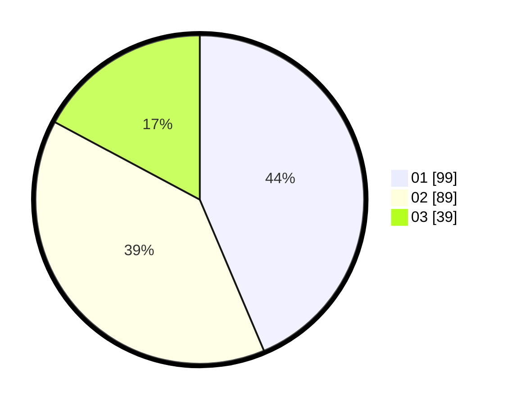

# Hasil

Hasil perolehan suara paslon dapat dilihat pada file paslon-01.txt, paslon-02.txt, dan paslon-03.txt.

Jika tidak ada, artinya data tersebut belum ada pada SIREKAP.

## Perolehan Suara

 * Paslon 01: **99**.
 * Paslon 02: **89**.
 * Paslon 03: **39**.

## Foto C Plano

https://sirekap-obj-formc.kpu.go.id/d590/pemilu/ppwp/31/74/04/10/06/3174041006114-20240214-220243--3a9a429b-c8ed-47da-9df2-5cb05d6e7645.jpg

https://sirekap-obj-formc.kpu.go.id/d590/pemilu/ppwp/31/74/04/10/06/3174041006114-20240214-220406--397470fc-62d7-499f-b4d0-66d2bc6b99f4.jpg

https://sirekap-obj-formc.kpu.go.id/d590/pemilu/ppwp/31/74/04/10/06/3174041006114-20240214-220515--4fbed103-96b0-4ba4-92cc-bfe85384faca.jpg

## DATA PEMILIH TETAP

Jumlah pemilih dalam DPT: **271**.
 * L: **142**.
 * P: **129**.

## DATA PENGGUNA HAK PILIH

Jumlah pengguna hak pilih dalam DPT: **227**.
 * L: **112**.
 * P: **115**.

Jumlah pengguna hak pilih dalam DPTb: **2**.
 * L: **2**.
 * P: **0**.

Jumlah pengguna hak pilih dalam DPK: **0**.
 * L: **0**.
 * P: **0**.

Jumlah pengguna hak pilih: **229**.
 * L: **114**.
 * P: **115**.

## JUMLAH SUARA SAH DAN TIDAK SAH

JUMLAH SELURUH SUARA SAH: **227**.

JUMLAH SUARA TIDAK SAH: **2**.

JUMLAH SELURUH SUARA SAH DAN SUARA TIDAK SAH: **229**.
