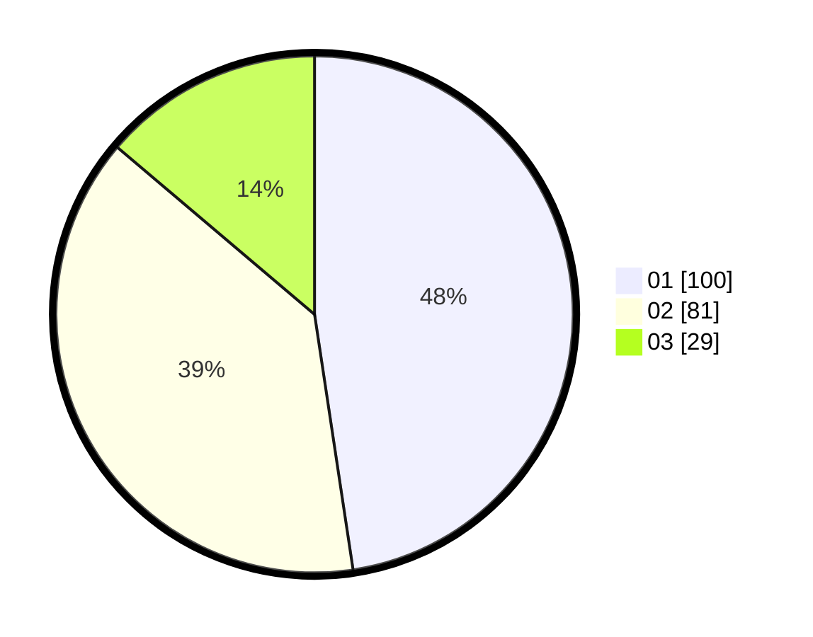

# Hasil

Hasil perolehan suara paslon dapat dilihat pada file paslon-01.txt, paslon-02.txt, dan paslon-03.txt.

Jika tidak ada, artinya data tersebut belum ada pada SIREKAP.

## Perolehan Suara

 * Paslon 01: **100**.
 * Paslon 02: **81**.
 * Paslon 03: **29**.

## Foto C Plano

https://sirekap-obj-formc.kpu.go.id/3262/pemilu/ppwp/31/74/04/10/06/3174041006115-20240214-184523--e4458f3f-0f94-4380-aefb-9cf94df14f99.jpg

https://sirekap-obj-formc.kpu.go.id/3262/pemilu/ppwp/31/74/04/10/06/3174041006115-20240214-155753--e9175157-3e27-4c56-9354-0e137418dd46.jpg

https://sirekap-obj-formc.kpu.go.id/3262/pemilu/ppwp/31/74/04/10/06/3174041006115-20240216-021205--90dfa13f-bafa-43e2-9911-96899c0ea734.jpg

## DATA PEMILIH TETAP

Jumlah pemilih dalam DPT: **270**.
 * L: **272**.
 * P: **732**.

## DATA PENGGUNA HAK PILIH

Jumlah pengguna hak pilih dalam DPT: **271**.
 * L: **702**.
 * P: **302**.

Jumlah pengguna hak pilih dalam DPTb: **3**.
 * L: **3**.
 * P: **8**.

Jumlah pengguna hak pilih dalam DPK: **0**.
 * L: **0**.
 * P: **0**.

Jumlah pengguna hak pilih: **272**.
 * L: **703**.
 * P: **105**.

## JUMLAH SUARA SAH DAN TIDAK SAH

JUMLAH SELURUH SUARA SAH: **210**.

JUMLAH SUARA TIDAK SAH: **2**.

JUMLAH SELURUH SUARA SAH DAN SUARA TIDAK SAH: **212**.
