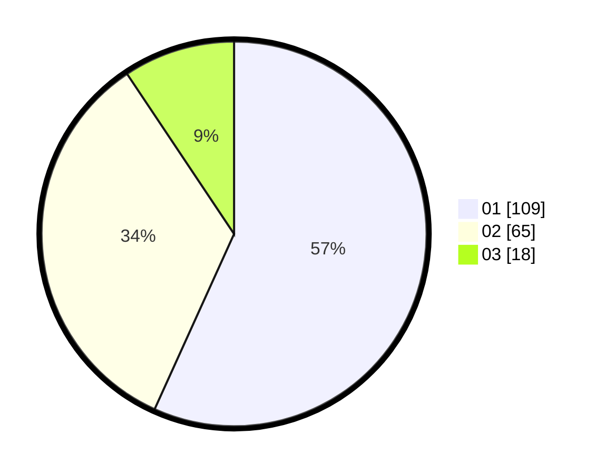

# Hasil

Hasil perolehan suara paslon dapat dilihat pada file paslon-01.txt, paslon-02.txt, dan paslon-03.txt.

Jika tidak ada, artinya data tersebut belum ada pada SIREKAP.

## Perolehan Suara

 * Paslon 01: **109**.
 * Paslon 02: **65**.
 * Paslon 03: **18**.

## Foto C Plano

https://sirekap-obj-formc.kpu.go.id/cfdb/pemilu/ppwp/31/74/04/10/06/3174041006117-20240214-184507--4cfcb96d-de92-447e-90d7-b7293a4ead8b.jpg

https://sirekap-obj-formc.kpu.go.id/cfdb/pemilu/ppwp/31/74/04/10/06/3174041006117-20240214-190855--d09cc241-c210-4d53-8b84-e7835e9ed36c.jpg

https://sirekap-obj-formc.kpu.go.id/cfdb/pemilu/ppwp/31/74/04/10/06/3174041006117-20240214-191049--f98094d1-fc40-46ce-b86e-93fe102d38a4.jpg

## DATA PEMILIH TETAP

Jumlah pemilih dalam DPT: **228**.
 * L: **127**.
 * P: **101**.

## DATA PENGGUNA HAK PILIH

Jumlah pengguna hak pilih dalam DPT: **186**.
 * L: **96**.
 * P: **90**.

Jumlah pengguna hak pilih dalam DPTb: **0**.
 * L: **0**.
 * P: **0**.

Jumlah pengguna hak pilih dalam DPK: **8**.
 * L: **5**.
 * P: **3**.

Jumlah pengguna hak pilih: **194**.
 * L: **101**.
 * P: **93**.

## JUMLAH SUARA SAH DAN TIDAK SAH

JUMLAH SELURUH SUARA SAH: **192**.

JUMLAH SUARA TIDAK SAH: **2**.

JUMLAH SELURUH SUARA SAH DAN SUARA TIDAK SAH: **194**.
