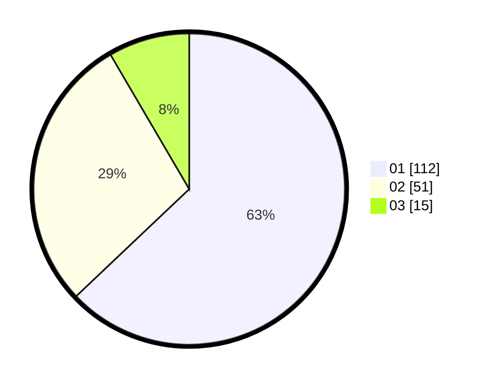

# Hasil

Hasil perolehan suara paslon dapat dilihat pada file paslon-01.txt, paslon-02.txt, dan paslon-03.txt.

Jika tidak ada, artinya data tersebut belum ada pada SIREKAP.

## Perolehan Suara

 * Paslon 01: **112**.
 * Paslon 02: **51**.
 * Paslon 03: **15**.

## Foto C Plano

https://sirekap-obj-formc.kpu.go.id/b46e/pemilu/ppwp/31/74/04/10/06/3174041006118-20240214-194655--c2285930-ad90-4402-a9ae-d50a55c5a387.jpg

https://sirekap-obj-formc.kpu.go.id/b46e/pemilu/ppwp/31/74/04/10/06/3174041006118-20240214-194731--a6c350d8-4187-4be4-9f6c-21a48083b7b7.jpg

https://sirekap-obj-formc.kpu.go.id/b46e/pemilu/ppwp/31/74/04/10/06/3174041006118-20240214-210851--f6dff38a-a8c9-4e2d-8204-a41ab8777064.jpg
