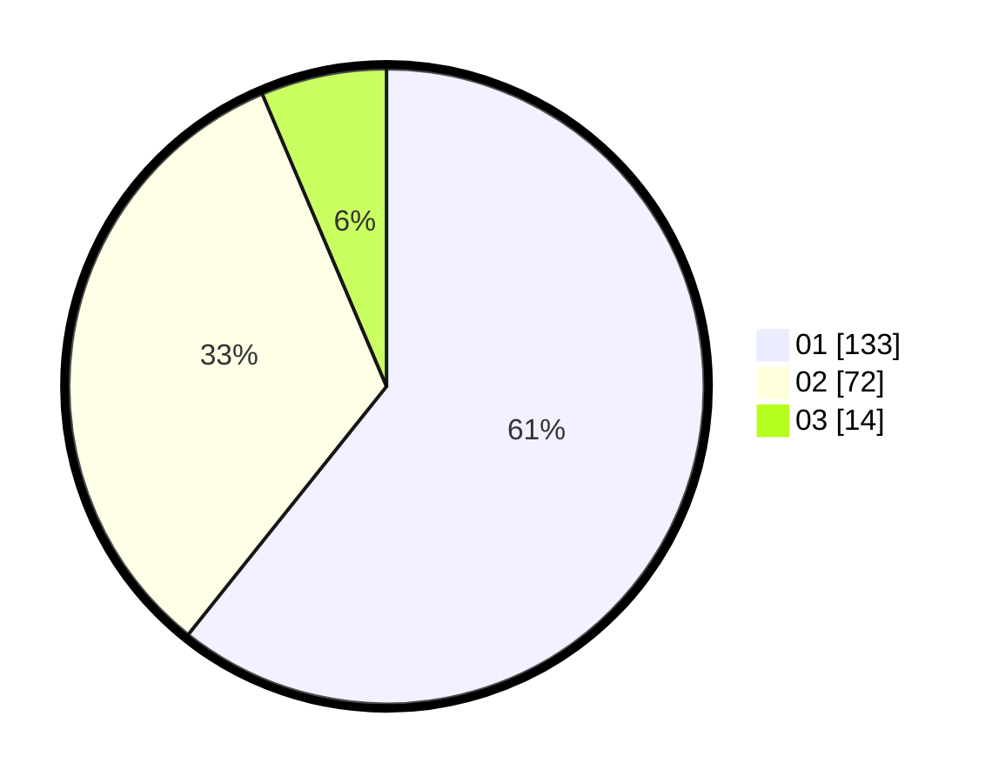

# Hasil

Hasil perolehan suara paslon dapat dilihat pada file paslon-01.txt, paslon-02.txt, dan paslon-03.txt.

Jika tidak ada, artinya data tersebut belum ada pada SIREKAP.

## Perolehan Suara

 * Paslon 01: **133**.
 * Paslon 02: **72**.
 * Paslon 03: **14**.

## Foto C Plano

https://sirekap-obj-formc.kpu.go.id/6b08/pemilu/ppwp/31/74/04/10/06/3174041006122-20240214-203512--272d313f-6733-4280-90f1-b3f06297c90f.jpg

https://sirekap-obj-formc.kpu.go.id/6b08/pemilu/ppwp/31/74/04/10/06/3174041006122-20240214-192523--71da9c8e-b95f-4867-8fe5-f17dbffbc4bb.jpg

https://sirekap-obj-formc.kpu.go.id/6b08/pemilu/ppwp/31/74/04/10/06/3174041006122-20240214-200831--c82b28d5-1a18-47ef-ab1e-fad24f3c7b0f.jpg

## DATA PEMILIH TETAP

Jumlah pemilih dalam DPT: **262**.
 * L: **148**.
 * P: **114**.

## DATA PENGGUNA HAK PILIH

Jumlah pengguna hak pilih dalam DPT: **222**.
 * L: **124**.
 * P: **98**.

Jumlah pengguna hak pilih dalam DPTb: **2**.
 * L: **0**.
 * P: **2**.

Jumlah pengguna hak pilih dalam DPK: **0**.
 * L: **0**.
 * P: **0**.

Jumlah pengguna hak pilih: **224**.
 * L: **124**.
 * P: **100**.

## JUMLAH SUARA SAH DAN TIDAK SAH

JUMLAH SELURUH SUARA SAH: **219**.

JUMLAH SUARA TIDAK SAH: **5**.

JUMLAH SELURUH SUARA SAH DAN SUARA TIDAK SAH: **224**.
