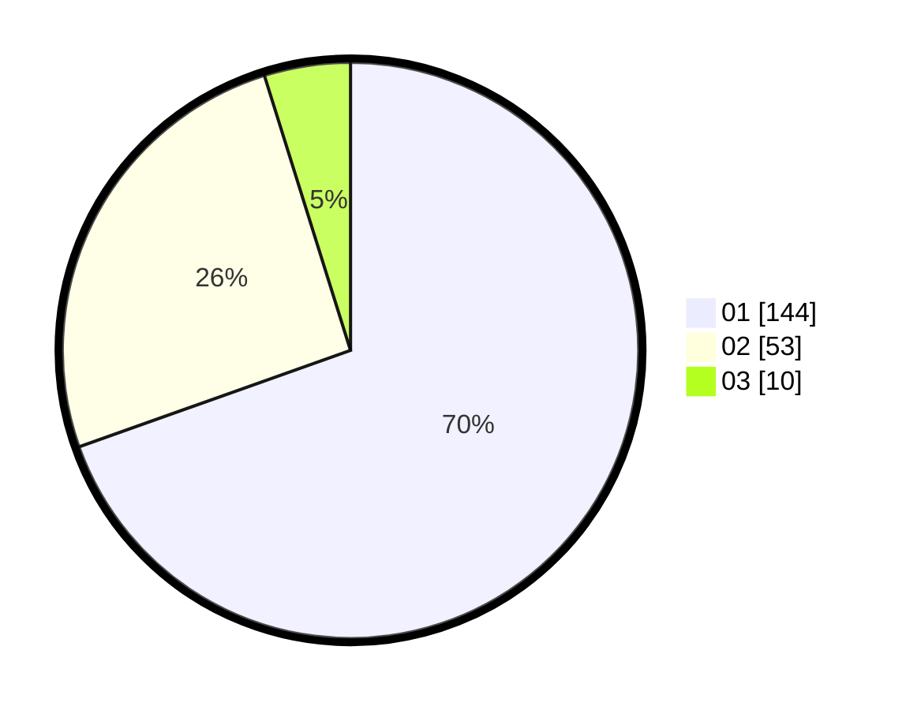

# Hasil

Hasil perolehan suara paslon dapat dilihat pada file paslon-01.txt, paslon-02.txt, dan paslon-03.txt.

Jika tidak ada, artinya data tersebut belum ada pada SIREKAP.

## Perolehan Suara

 * Paslon 01: **144**.
 * Paslon 02: **53**.
 * Paslon 03: **10**.

## Foto C Plano

https://sirekap-obj-formc.kpu.go.id/8c71/pemilu/ppwp/31/74/04/10/06/3174041006123-20240215-030041--b3a7ae7d-caf5-40ae-ac33-4cda18c2d7a8.jpg

https://sirekap-obj-formc.kpu.go.id/8c71/pemilu/ppwp/31/74/04/10/06/3174041006123-20240214-234506--3b68937b-78be-4168-a7b0-c2f1bb433594.jpg

https://sirekap-obj-formc.kpu.go.id/8c71/pemilu/ppwp/31/74/04/10/06/3174041006123-20240214-234514--670a8595-2966-452c-87bd-cb8138951112.jpg

## DATA PEMILIH TETAP

Jumlah pemilih dalam DPT: **257**.
 * L: **124**.
 * P: **133**.

## DATA PENGGUNA HAK PILIH

Jumlah pengguna hak pilih dalam DPT: **207**.
 * L: **97**.
 * P: **110**.

Jumlah pengguna hak pilih dalam DPTb: **4**.
 * L: **2**.
 * P: **2**.

Jumlah pengguna hak pilih dalam DPK: **3**.
 * L: **0**.
 * P: **3**.

Jumlah pengguna hak pilih: **214**.
 * L: **99**.
 * P: **115**.

## JUMLAH SUARA SAH DAN TIDAK SAH

JUMLAH SELURUH SUARA SAH: **7**.

JUMLAH SUARA TIDAK SAH: **7**.

JUMLAH SELURUH SUARA SAH DAN SUARA TIDAK SAH: **214**.
