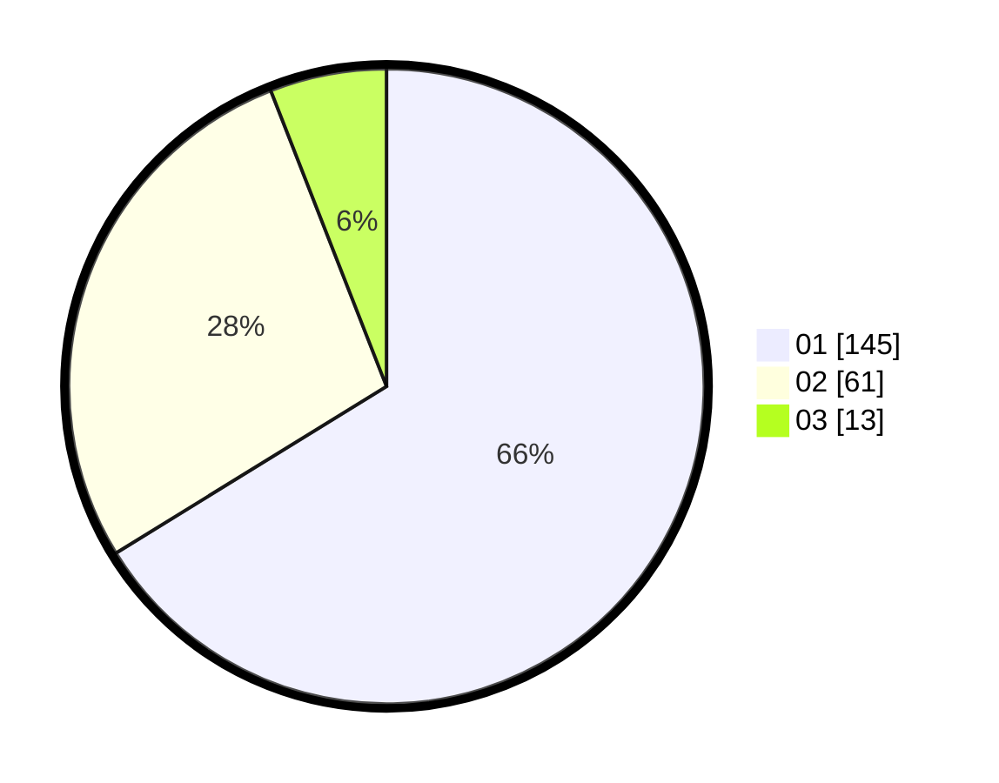

# Hasil

Hasil perolehan suara paslon dapat dilihat pada file paslon-01.txt, paslon-02.txt, dan paslon-03.txt.

Jika tidak ada, artinya data tersebut belum ada pada SIREKAP.

## Perolehan Suara

 * Paslon 01: **145**.
 * Paslon 02: **61**.
 * Paslon 03: **13**.

## Foto C Plano

https://sirekap-obj-formc.kpu.go.id/c8ec/pemilu/ppwp/31/74/04/10/06/3174041006129-20240217-053702--fe202301-9e63-4a9d-96c6-0515ef69bca1.jpg

https://sirekap-obj-formc.kpu.go.id/c8ec/pemilu/ppwp/31/74/04/10/06/3174041006129-20240217-053849--06b72afa-e266-48fc-9e6e-c5be6f7c93ad.jpg

https://sirekap-obj-formc.kpu.go.id/c8ec/pemilu/ppwp/31/74/04/10/06/3174041006129-20240217-054256--090966dc-a708-42cb-a8af-e96bffe3a85e.jpg
