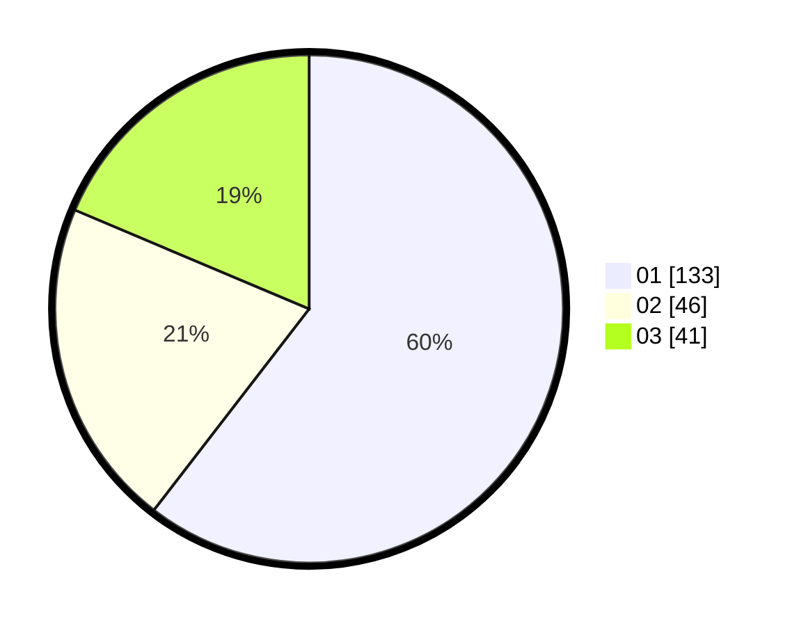

# Hasil

Hasil perolehan suara paslon dapat dilihat pada file paslon-01.txt, paslon-02.txt, dan paslon-03.txt.

Jika tidak ada, artinya data tersebut belum ada pada SIREKAP.

## Perolehan Suara

 * Paslon 01: **133**.
 * Paslon 02: **46**.
 * Paslon 03: **41**.

## Foto C Plano

https://sirekap-obj-formc.kpu.go.id/e325/pemilu/ppwp/31/74/04/10/07/3174041007001-20240214-155531--83b106d8-41d1-41da-bdbf-4996854d2a40.jpg

https://sirekap-obj-formc.kpu.go.id/e325/pemilu/ppwp/31/74/04/10/07/3174041007001-20240214-155720--b571dc88-e868-4ea5-9fa2-28b6cf4babd8.jpg

https://sirekap-obj-formc.kpu.go.id/e325/pemilu/ppwp/31/74/04/10/07/3174041007001-20240214-155632--48d6dfa2-5bbc-481b-bc0d-fa10907da0c8.jpg
