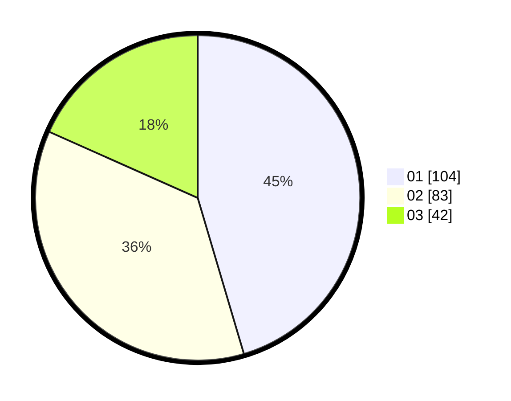

# Hasil

Hasil perolehan suara paslon dapat dilihat pada file paslon-01.txt, paslon-02.txt, dan paslon-03.txt.

Jika tidak ada, artinya data tersebut belum ada pada SIREKAP.

## Perolehan Suara

 * Paslon 01: **104**.
 * Paslon 02: **83**.
 * Paslon 03: **42**.

## Foto C Plano

https://sirekap-obj-formc.kpu.go.id/3083/pemilu/ppwp/31/74/04/10/07/3174041007012-20240215-000547--c99512b0-d781-4196-98f0-1e4f1fe72736.jpg

https://sirekap-obj-formc.kpu.go.id/3083/pemilu/ppwp/31/74/04/10/07/3174041007012-20240214-214200--bb9326a6-0236-4202-983d-7dc83b0bbbdd.jpg

https://sirekap-obj-formc.kpu.go.id/3083/pemilu/ppwp/31/74/04/10/07/3174041007012-20240215-000657--ec51d5a1-2c4c-46cb-8864-b51cbe8682a7.jpg

## DATA PEMILIH TETAP

Jumlah pemilih dalam DPT: **277**.
 * L: **137**.
 * P: **140**.

## DATA PENGGUNA HAK PILIH

Jumlah pengguna hak pilih dalam DPT: **225**.
 * L: **108**.
 * P: **117**.

Jumlah pengguna hak pilih dalam DPTb: **8**.
 * L: **5**.
 * P: **3**.

Jumlah pengguna hak pilih dalam DPK: **4**.
 * L: **2**.
 * P: **2**.

Jumlah pengguna hak pilih: **237**.
 * L: **115**.
 * P: **122**.

## JUMLAH SUARA SAH DAN TIDAK SAH

JUMLAH SELURUH SUARA SAH: **229**.

JUMLAH SUARA TIDAK SAH: **8**.

JUMLAH SELURUH SUARA SAH DAN SUARA TIDAK SAH: **237**.
