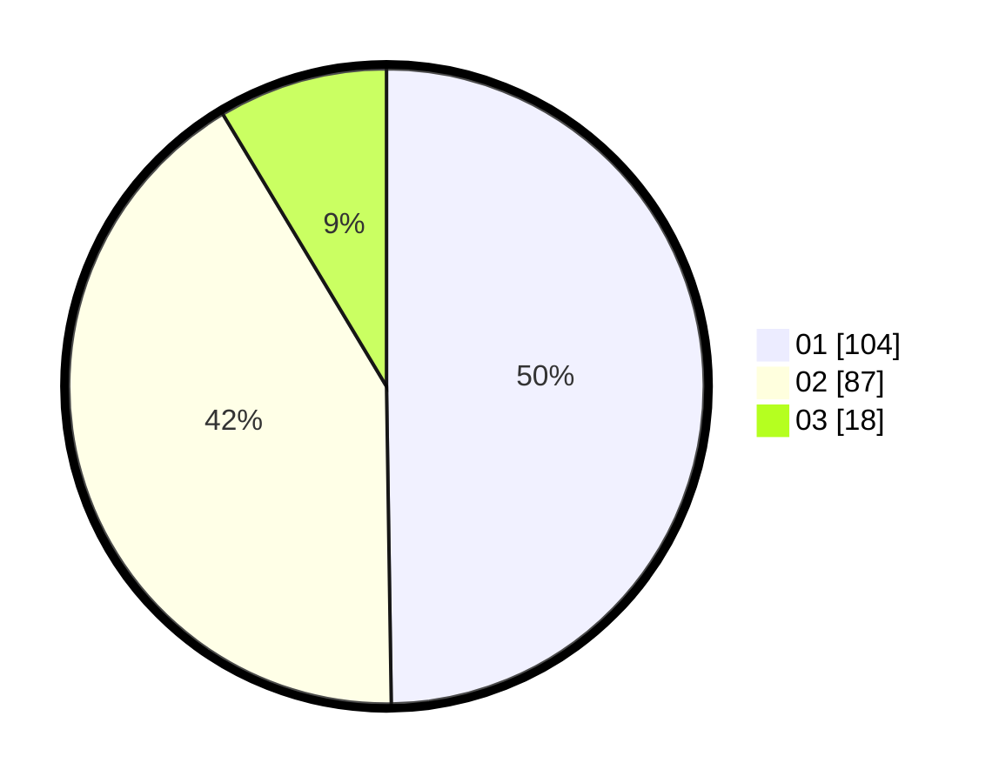

# Hasil

Hasil perolehan suara paslon dapat dilihat pada file paslon-01.txt, paslon-02.txt, dan paslon-03.txt.

Jika tidak ada, artinya data tersebut belum ada pada SIREKAP.

## Perolehan Suara

 * Paslon 01: **104**.
 * Paslon 02: **87**.
 * Paslon 03: **18**.

## Foto C Plano

https://sirekap-obj-formc.kpu.go.id/b785/pemilu/ppwp/31/74/04/10/07/3174041007016-20240214-202248--7c212184-1d2b-4c7f-a72f-da2ab3ea0565.jpg

https://sirekap-obj-formc.kpu.go.id/b785/pemilu/ppwp/31/74/04/10/07/3174041007016-20240214-202457--8c76ea86-4eec-480f-9f99-9aef50b1baf5.jpg

https://sirekap-obj-formc.kpu.go.id/b785/pemilu/ppwp/31/74/04/10/07/3174041007016-20240214-202348--0b9828ef-b2ff-4637-9ae5-1e224185f6b0.jpg

## DATA PEMILIH TETAP

Jumlah pemilih dalam DPT: **255**.
 * L: **119**.
 * P: **136**.

## DATA PENGGUNA HAK PILIH

Jumlah pengguna hak pilih dalam DPT: **200**.
 * L: **87**.
 * P: **113**.

Jumlah pengguna hak pilih dalam DPTb: **12**.
 * L: **7**.
 * P: **5**.

Jumlah pengguna hak pilih dalam DPK: **2**.
 * L: **0**.
 * P: **2**.

Jumlah pengguna hak pilih: **214**.
 * L: **94**.
 * P: **120**.

## JUMLAH SUARA SAH DAN TIDAK SAH

JUMLAH SELURUH SUARA SAH: **209**.

JUMLAH SUARA TIDAK SAH: **5**.

JUMLAH SELURUH SUARA SAH DAN SUARA TIDAK SAH: **214**.
