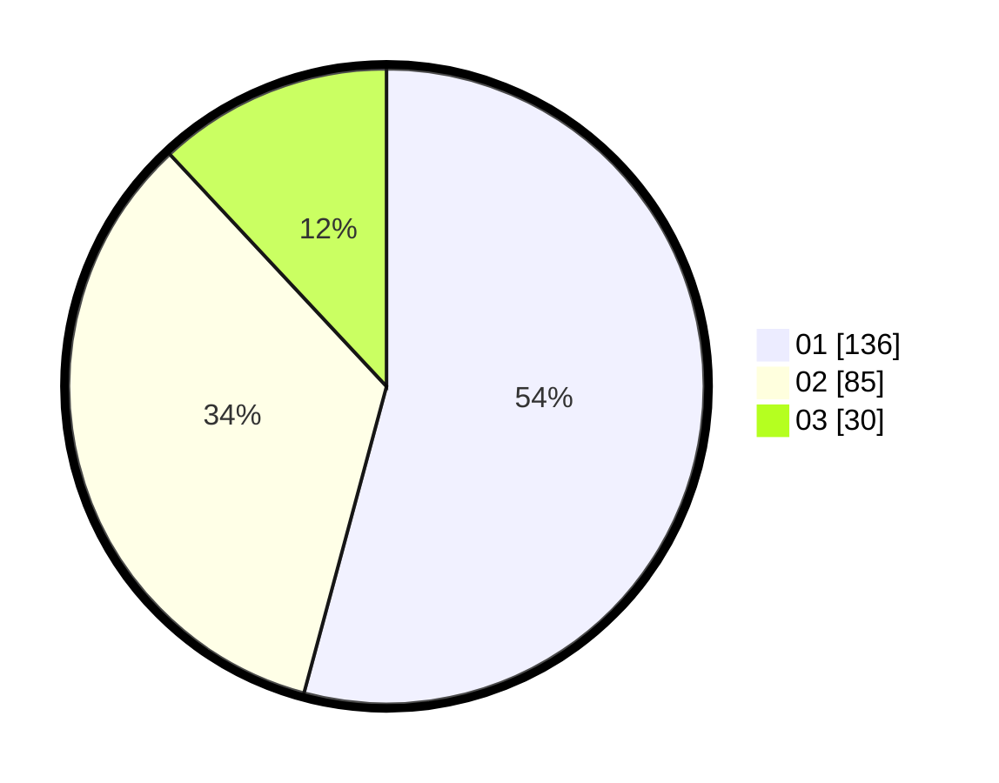

# Hasil

Hasil perolehan suara paslon dapat dilihat pada file paslon-01.txt, paslon-02.txt, dan paslon-03.txt.

Jika tidak ada, artinya data tersebut belum ada pada SIREKAP.

## Perolehan Suara

 * Paslon 01: **136**.
 * Paslon 02: **85**.
 * Paslon 03: **30**.

## Foto C Plano

https://sirekap-obj-formc.kpu.go.id/645d/pemilu/ppwp/31/74/04/10/07/3174041007023-20240214-194539--848799e6-c32b-458f-bc1d-fc073ea18a52.jpg

https://sirekap-obj-formc.kpu.go.id/645d/pemilu/ppwp/31/74/04/10/07/3174041007023-20240214-194645--e4d7513d-a5b2-4f6f-8c5e-286ad2779c61.jpg

https://sirekap-obj-formc.kpu.go.id/645d/pemilu/ppwp/31/74/04/10/07/3174041007023-20240214-194743--f8eabae6-6e03-4888-b4e9-47f3e715dfeb.jpg

## DATA PEMILIH TETAP

Jumlah pemilih dalam DPT: **287**.
 * L: **144**.
 * P: **143**.

## DATA PENGGUNA HAK PILIH

Jumlah pengguna hak pilih dalam DPT: **242**.
 * L: **119**.
 * P: **129**.

Jumlah pengguna hak pilih dalam DPTb: **2**.
 * L: **2**.
 * P: **5**.

Jumlah pengguna hak pilih dalam DPK: **1**.
 * L: **1**.
 * P: **0**.

Jumlah pengguna hak pilih: **256**.
 * L: **722**.
 * P: **134**.

## JUMLAH SUARA SAH DAN TIDAK SAH

JUMLAH SELURUH SUARA SAH: **251**.

JUMLAH SUARA TIDAK SAH: **5**.

JUMLAH SELURUH SUARA SAH DAN SUARA TIDAK SAH: **256**.
