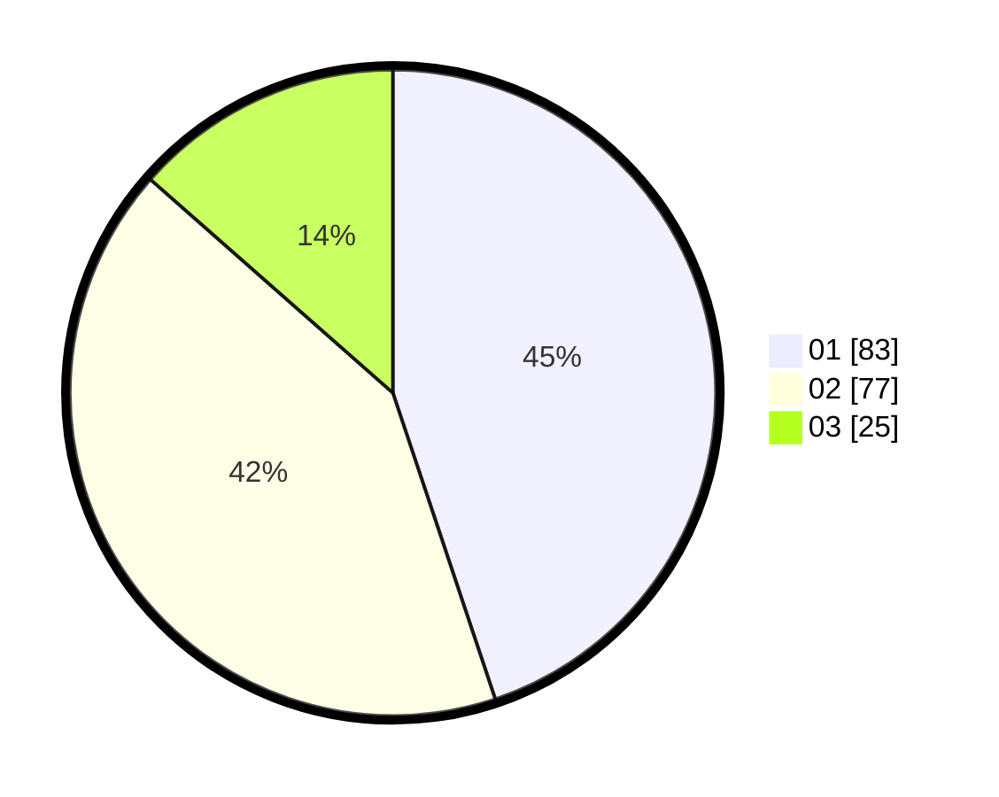

# Hasil

Hasil perolehan suara paslon dapat dilihat pada file paslon-01.txt, paslon-02.txt, dan paslon-03.txt.

Jika tidak ada, artinya data tersebut belum ada pada SIREKAP.

## Perolehan Suara

 * Paslon 01: **83**.
 * Paslon 02: **77**.
 * Paslon 03: **25**.

## Foto C Plano

https://sirekap-obj-formc.kpu.go.id/3073/pemilu/ppwp/31/74/04/10/07/3174041007029-20240214-184658--b5cdf351-bdad-4125-85d2-c3011e11c140.jpg

https://sirekap-obj-formc.kpu.go.id/3073/pemilu/ppwp/31/74/04/10/07/3174041007029-20240214-184707--fd0b6be6-128f-4fac-90b7-19e7f46762be.jpg

https://sirekap-obj-formc.kpu.go.id/3073/pemilu/ppwp/31/74/04/10/07/3174041007029-20240214-184828--14972c7b-d718-4ac6-b8ef-9e8a8f4d9123.jpg

## DATA PEMILIH TETAP

Jumlah pemilih dalam DPT: **206**.
 * L: **102**.
 * P: **104**.

## DATA PENGGUNA HAK PILIH

Jumlah pengguna hak pilih dalam DPT: **182**.
 * L: **89**.
 * P: **93**.

Jumlah pengguna hak pilih dalam DPTb: **4**.
 * L: **2**.
 * P: **2**.

Jumlah pengguna hak pilih dalam DPK: **2**.
 * L: **0**.
 * P: **2**.

Jumlah pengguna hak pilih: **188**.
 * L: **91**.
 * P: **97**.

## JUMLAH SUARA SAH DAN TIDAK SAH

JUMLAH SELURUH SUARA SAH: **185**.

JUMLAH SUARA TIDAK SAH: **3**.

JUMLAH SELURUH SUARA SAH DAN SUARA TIDAK SAH: **188**.
