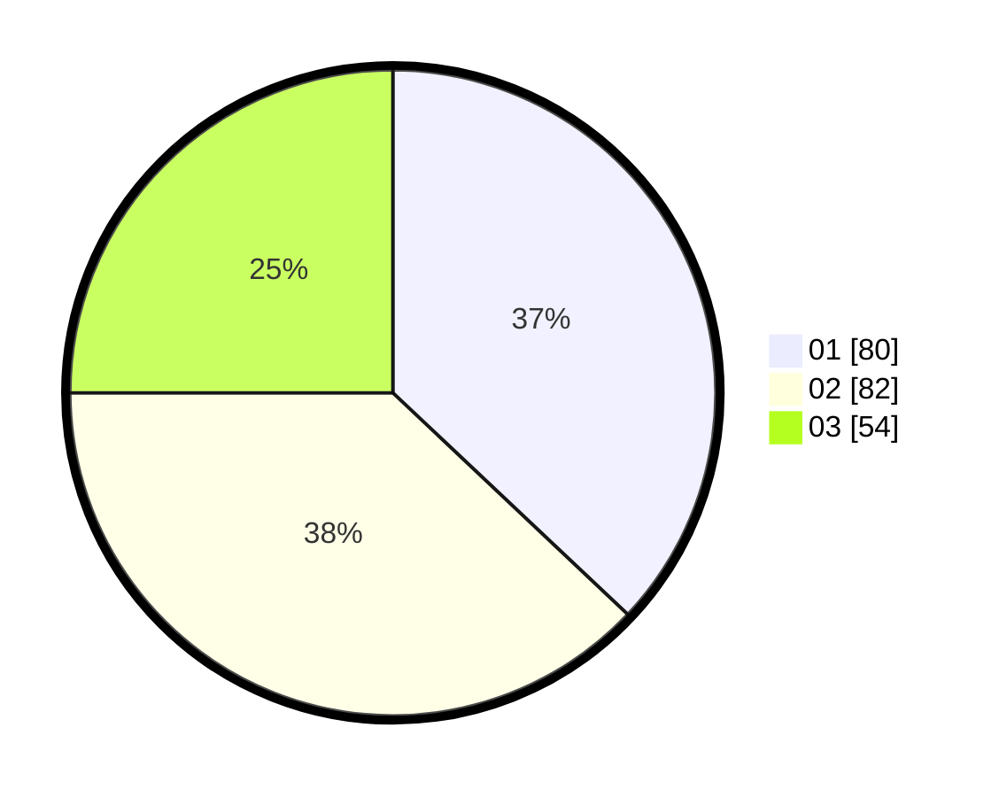

# Hasil

Hasil perolehan suara paslon dapat dilihat pada file paslon-01.txt, paslon-02.txt, dan paslon-03.txt.

Jika tidak ada, artinya data tersebut belum ada pada SIREKAP.

## Perolehan Suara

 * Paslon 01: **80**.
 * Paslon 02: **82**.
 * Paslon 03: **54**.

## Foto C Plano

https://sirekap-obj-formc.kpu.go.id/1292/pemilu/ppwp/31/74/04/10/07/3174041007033-20240214-190447--8f1e23d5-4b93-470d-a0f4-8cb765c2f2dd.jpg

https://sirekap-obj-formc.kpu.go.id/1292/pemilu/ppwp/31/74/04/10/07/3174041007033-20240214-190459--b20028b1-4e8b-4555-b111-d072c4d8eea3.jpg

https://sirekap-obj-formc.kpu.go.id/1292/pemilu/ppwp/31/74/04/10/07/3174041007033-20240214-190504--c0383484-15a6-4cf2-81ed-12b8a109b22b.jpg

## DATA PEMILIH TETAP

Jumlah pemilih dalam DPT: **245**.
 * L: **125**.
 * P: **120**.

## DATA PENGGUNA HAK PILIH

Jumlah pengguna hak pilih dalam DPT: **212**.
 * L: **105**.
 * P: **107**.

Jumlah pengguna hak pilih dalam DPTb: **6**.
 * L: **3**.
 * P: **3**.

Jumlah pengguna hak pilih dalam DPK: **0**.
 * L: **0**.
 * P: **0**.

Jumlah pengguna hak pilih: **218**.
 * L: **108**.
 * P: **110**.

## JUMLAH SUARA SAH DAN TIDAK SAH

JUMLAH SELURUH SUARA SAH: **216**.

JUMLAH SUARA TIDAK SAH: **2**.

JUMLAH SELURUH SUARA SAH DAN SUARA TIDAK SAH: **218**.
