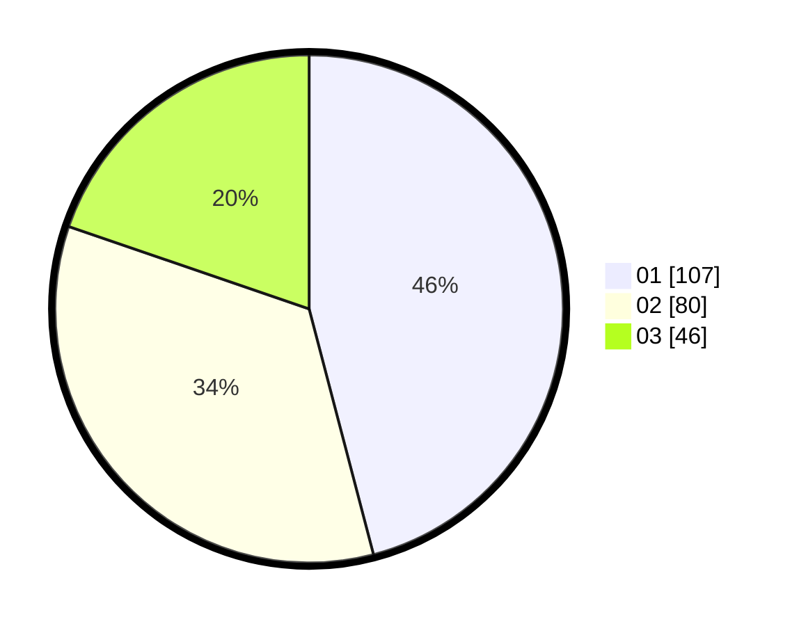

# Hasil

Hasil perolehan suara paslon dapat dilihat pada file paslon-01.txt, paslon-02.txt, dan paslon-03.txt.

Jika tidak ada, artinya data tersebut belum ada pada SIREKAP.

## Perolehan Suara

 * Paslon 01: **107**.
 * Paslon 02: **80**.
 * Paslon 03: **46**.

## Foto C Plano

https://sirekap-obj-formc.kpu.go.id/72ca/pemilu/ppwp/31/74/04/10/07/3174041007038-20240214-155555--e83fb6c0-51bb-4d2d-af09-1ad721193bf2.jpg

https://sirekap-obj-formc.kpu.go.id/72ca/pemilu/ppwp/31/74/04/10/07/3174041007038-20240214-155902--65cf9d2a-5adf-4eb1-8ba4-12f4c975183a.jpg

https://sirekap-obj-formc.kpu.go.id/72ca/pemilu/ppwp/31/74/04/10/07/3174041007038-20240215-090735--385d5d35-dbd1-44ff-a59c-3d5a511aa1da.jpg

## DATA PEMILIH TETAP

Jumlah pemilih dalam DPT: **270**.
 * L: **127**.
 * P: **143**.

## DATA PENGGUNA HAK PILIH

Jumlah pengguna hak pilih dalam DPT: **231**.
 * L: **111**.
 * P: **120**.

Jumlah pengguna hak pilih dalam DPTb: **2**.
 * L: **1**.
 * P: **1**.

Jumlah pengguna hak pilih dalam DPK: **2**.
 * L: **2**.
 * P: **0**.

Jumlah pengguna hak pilih: **235**.
 * L: **114**.
 * P: **121**.

## JUMLAH SUARA SAH DAN TIDAK SAH

JUMLAH SELURUH SUARA SAH: **233**.

JUMLAH SUARA TIDAK SAH: **2**.

JUMLAH SELURUH SUARA SAH DAN SUARA TIDAK SAH: **235**.
