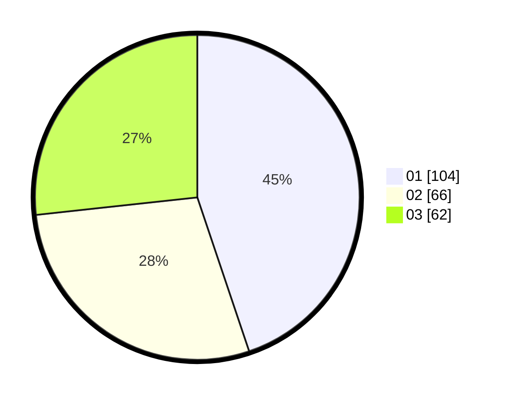

# Hasil

Hasil perolehan suara paslon dapat dilihat pada file paslon-01.txt, paslon-02.txt, dan paslon-03.txt.

Jika tidak ada, artinya data tersebut belum ada pada SIREKAP.

## Perolehan Suara

 * Paslon 01: **104**.
 * Paslon 02: **66**.
 * Paslon 03: **62**.

## Foto C Plano

https://sirekap-obj-formc.kpu.go.id/189b/pemilu/ppwp/31/74/04/10/07/3174041007039-20240214-221809--5cd0cd71-e549-436a-acf1-aa5e85d9d6dc.jpg

https://sirekap-obj-formc.kpu.go.id/189b/pemilu/ppwp/31/74/04/10/07/3174041007039-20240214-204559--f2c3118b-1174-4c84-b457-6a7389625153.jpg

https://sirekap-obj-formc.kpu.go.id/189b/pemilu/ppwp/31/74/04/10/07/3174041007039-20240214-204640--60d2b228-bbb1-431b-bf55-72773f5b07bf.jpg

## DATA PEMILIH TETAP

Jumlah pemilih dalam DPT: **272**.
 * L: **134**.
 * P: **138**.

## DATA PENGGUNA HAK PILIH

Jumlah pengguna hak pilih dalam DPT: **235**.
 * L: **113**.
 * P: **122**.

Jumlah pengguna hak pilih dalam DPTb: **6**.
 * L: **3**.
 * P: **3**.

Jumlah pengguna hak pilih dalam DPK: **1**.
 * L: **0**.
 * P: **1**.

Jumlah pengguna hak pilih: **242**.
 * L: **3**.
 * P: **4**.

## JUMLAH SUARA SAH DAN TIDAK SAH

JUMLAH SELURUH SUARA SAH: **232**.

JUMLAH SUARA TIDAK SAH: **10**.

JUMLAH SELURUH SUARA SAH DAN SUARA TIDAK SAH: **242**.
