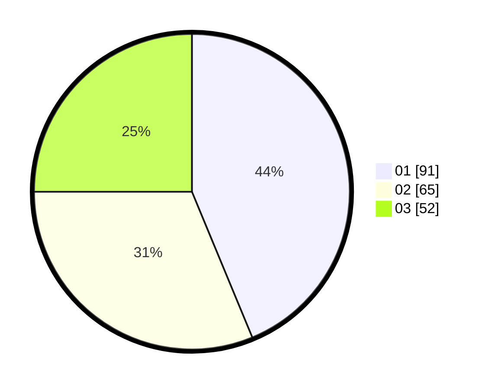

# Hasil

Hasil perolehan suara paslon dapat dilihat pada file paslon-01.txt, paslon-02.txt, dan paslon-03.txt.

Jika tidak ada, artinya data tersebut belum ada pada SIREKAP.

## Perolehan Suara

 * Paslon 01: **91**.
 * Paslon 02: **65**.
 * Paslon 03: **52**.

## Foto C Plano

https://sirekap-obj-formc.kpu.go.id/d9ca/pemilu/ppwp/31/74/04/10/07/3174041007042-20240218-034030--03c492e3-7705-4ad7-9677-c511a4dcb131.jpg

https://sirekap-obj-formc.kpu.go.id/d9ca/pemilu/ppwp/31/74/04/10/07/3174041007042-20240214-232454--25a92ea4-26c2-4fbd-86ca-d2c9e47a9a66.jpg

https://sirekap-obj-formc.kpu.go.id/d9ca/pemilu/ppwp/31/74/04/10/07/3174041007042-20240214-232502--05a46d7d-08e3-4024-8ef7-6002ce1f89fd.jpg
