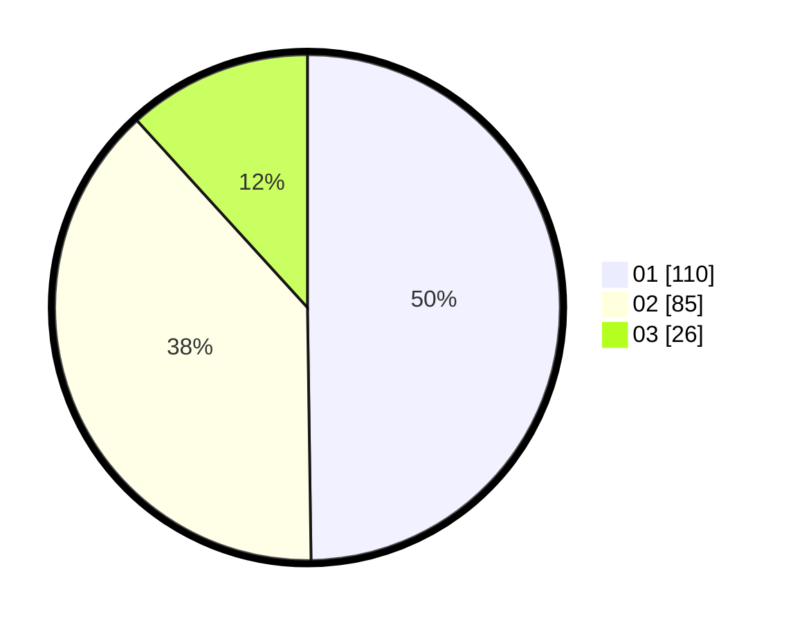

# Hasil

Hasil perolehan suara paslon dapat dilihat pada file paslon-01.txt, paslon-02.txt, dan paslon-03.txt.

Jika tidak ada, artinya data tersebut belum ada pada SIREKAP.

## Perolehan Suara

 * Paslon 01: **110**.
 * Paslon 02: **85**.
 * Paslon 03: **26**.

## Foto C Plano

https://sirekap-obj-formc.kpu.go.id/d057/pemilu/ppwp/31/74/04/10/07/3174041007055-20240215-205844--7032b2d8-265f-408b-a6f7-1ae409cf7fd8.jpg

https://sirekap-obj-formc.kpu.go.id/d057/pemilu/ppwp/31/74/04/10/07/3174041007055-20240215-205847--859fcf4f-a19b-408a-b51a-9c2c4eb342d5.jpg

https://sirekap-obj-formc.kpu.go.id/d057/pemilu/ppwp/31/74/04/10/07/3174041007055-20240215-205846--1993799d-e0b1-4538-9df2-a57f46571680.jpg

## DATA PEMILIH TETAP

Jumlah pemilih dalam DPT: **264**.
 * L: **128**.
 * P: **136**.

## DATA PENGGUNA HAK PILIH

Jumlah pengguna hak pilih dalam DPT: **222**.
 * L: **104**.
 * P: **118**.

Jumlah pengguna hak pilih dalam DPTb: **0**.
 * L: **0**.
 * P: **0**.

Jumlah pengguna hak pilih dalam DPK: **3**.
 * L: **2**.
 * P: **1**.

Jumlah pengguna hak pilih: **225**.
 * L: **106**.
 * P: **119**.

## JUMLAH SUARA SAH DAN TIDAK SAH

JUMLAH SELURUH SUARA SAH: **221**.

JUMLAH SUARA TIDAK SAH: **4**.

JUMLAH SELURUH SUARA SAH DAN SUARA TIDAK SAH: **225**.
