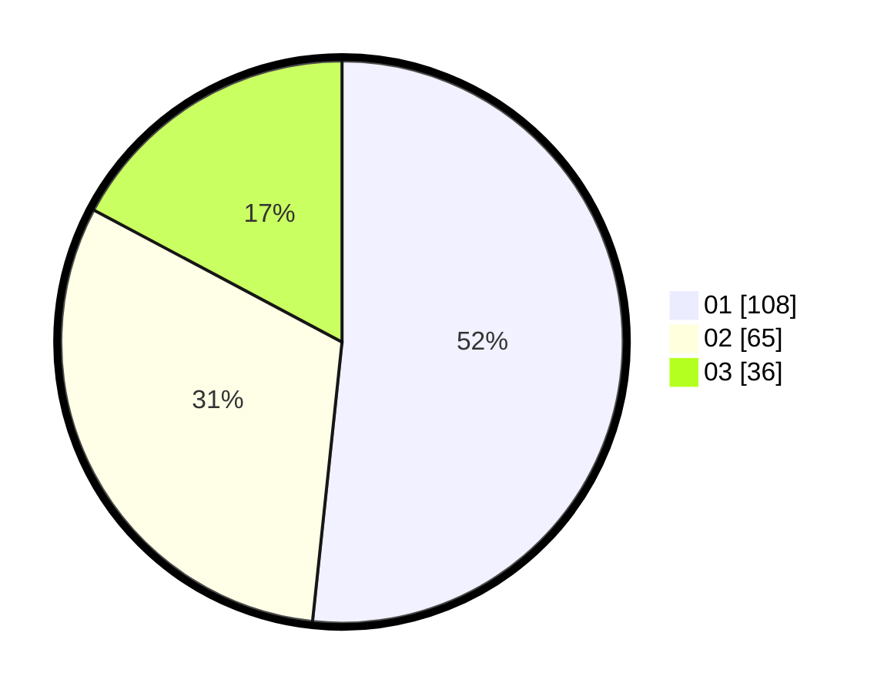

# Hasil

Hasil perolehan suara paslon dapat dilihat pada file paslon-01.txt, paslon-02.txt, dan paslon-03.txt.

Jika tidak ada, artinya data tersebut belum ada pada SIREKAP.

## Perolehan Suara

 * Paslon 01: **108**.
 * Paslon 02: **65**.
 * Paslon 03: **36**.

## Foto C Plano

https://sirekap-obj-formc.kpu.go.id/eebb/pemilu/ppwp/31/74/04/10/07/3174041007058-20240214-212809--86feaea4-6042-4572-9295-5fe20cf6ff13.jpg

https://sirekap-obj-formc.kpu.go.id/eebb/pemilu/ppwp/31/74/04/10/07/3174041007058-20240214-212923--6448b32f-e171-44ce-9454-c16888cf1968.jpg

https://sirekap-obj-formc.kpu.go.id/eebb/pemilu/ppwp/31/74/04/10/07/3174041007058-20240214-213033--677e09ef-a608-4e53-853d-a2f2f6412d34.jpg

## DATA PEMILIH TETAP

Jumlah pemilih dalam DPT: **264**.
 * L: **135**.
 * P: **129**.

## DATA PENGGUNA HAK PILIH

Jumlah pengguna hak pilih dalam DPT: **204**.
 * L: **96**.
 * P: **108**.

Jumlah pengguna hak pilih dalam DPTb: **5**.
 * L: **0**.
 * P: **5**.

Jumlah pengguna hak pilih dalam DPK: **2**.
 * L: **0**.
 * P: **2**.

Jumlah pengguna hak pilih: **211**.
 * L: **96**.
 * P: **115**.

## JUMLAH SUARA SAH DAN TIDAK SAH

JUMLAH SELURUH SUARA SAH: **209**.

JUMLAH SUARA TIDAK SAH: **2**.

JUMLAH SELURUH SUARA SAH DAN SUARA TIDAK SAH: **211**.
