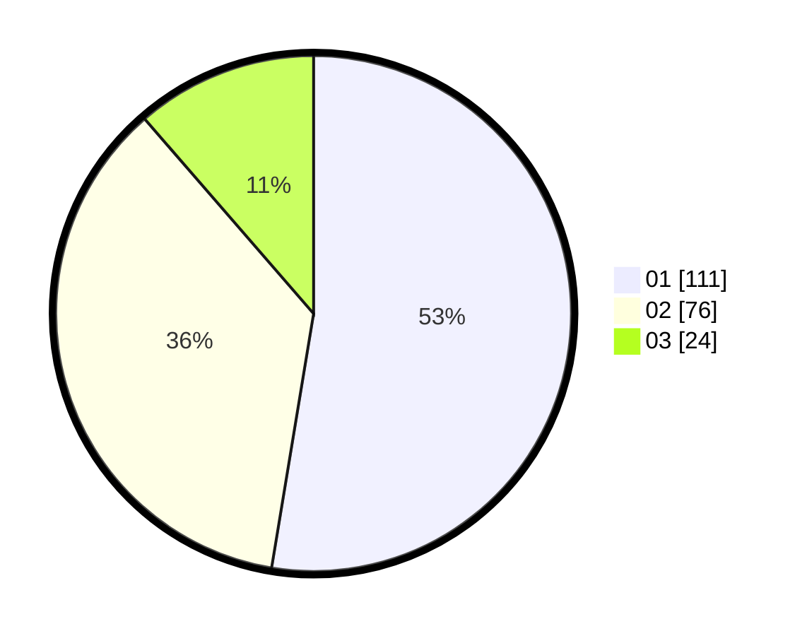

# Hasil

Hasil perolehan suara paslon dapat dilihat pada file paslon-01.txt, paslon-02.txt, dan paslon-03.txt.

Jika tidak ada, artinya data tersebut belum ada pada SIREKAP.

## Perolehan Suara

 * Paslon 01: **111**.
 * Paslon 02: **76**.
 * Paslon 03: **24**.

## Foto C Plano

https://sirekap-obj-formc.kpu.go.id/0600/pemilu/ppwp/31/74/04/10/07/3174041007062-20240214-221014--7e201680-d557-42ce-9b9e-81ca19964fc6.jpg

https://sirekap-obj-formc.kpu.go.id/0600/pemilu/ppwp/31/74/04/10/07/3174041007062-20240214-221223--ade854eb-eb1a-4d94-ba5d-78e900fe4c31.jpg

https://sirekap-obj-formc.kpu.go.id/0600/pemilu/ppwp/31/74/04/10/07/3174041007062-20240214-221256--886eb654-2ba7-4dc7-8a85-b7f43c3523cf.jpg

## DATA PEMILIH TETAP

Jumlah pemilih dalam DPT: **277**.
 * L: **140**.
 * P: **137**.

## DATA PENGGUNA HAK PILIH

Jumlah pengguna hak pilih dalam DPT: **214**.
 * L: **102**.
 * P: **112**.

Jumlah pengguna hak pilih dalam DPTb: **0**.
 * L: **0**.
 * P: **0**.

Jumlah pengguna hak pilih dalam DPK: **1**.
 * L: **0**.
 * P: **1**.

Jumlah pengguna hak pilih: **215**.
 * L: **102**.
 * P: **113**.

## JUMLAH SUARA SAH DAN TIDAK SAH

JUMLAH SELURUH SUARA SAH: **211**.

JUMLAH SUARA TIDAK SAH: **4**.

JUMLAH SELURUH SUARA SAH DAN SUARA TIDAK SAH: **215**.
