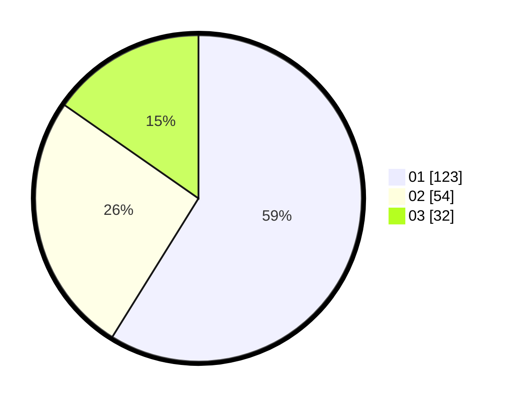

# Hasil

Hasil perolehan suara paslon dapat dilihat pada file paslon-01.txt, paslon-02.txt, dan paslon-03.txt.

Jika tidak ada, artinya data tersebut belum ada pada SIREKAP.

## Perolehan Suara

 * Paslon 01: **123**.
 * Paslon 02: **54**.
 * Paslon 03: **32**.

## Foto C Plano

https://sirekap-obj-formc.kpu.go.id/8dc3/pemilu/ppwp/31/74/04/10/07/3174041007071-20240214-193344--e1dbee4b-73b7-4dce-add3-1564dddd78ee.jpg

https://sirekap-obj-formc.kpu.go.id/8dc3/pemilu/ppwp/31/74/04/10/07/3174041007071-20240214-193424--aee9dfd9-ee9b-4215-91b5-93c68628854c.jpg

https://sirekap-obj-formc.kpu.go.id/8dc3/pemilu/ppwp/31/74/04/10/07/3174041007071-20240214-193456--b4801db2-8aca-4ec8-87cc-2684e5605d09.jpg

## DATA PEMILIH TETAP

Jumlah pemilih dalam DPT: **256**.
 * L: **122**.
 * P: **134**.

## DATA PENGGUNA HAK PILIH

Jumlah pengguna hak pilih dalam DPT: **207**.
 * L: **100**.
 * P: **107**.

Jumlah pengguna hak pilih dalam DPTb: **5**.
 * L: **3**.
 * P: **2**.

Jumlah pengguna hak pilih dalam DPK: **3**.
 * L: **1**.
 * P: **2**.

Jumlah pengguna hak pilih: **215**.
 * L: **104**.
 * P: **211**.

## JUMLAH SUARA SAH DAN TIDAK SAH

JUMLAH SELURUH SUARA SAH: **209**.

JUMLAH SUARA TIDAK SAH: **6**.

JUMLAH SELURUH SUARA SAH DAN SUARA TIDAK SAH: **215**.
