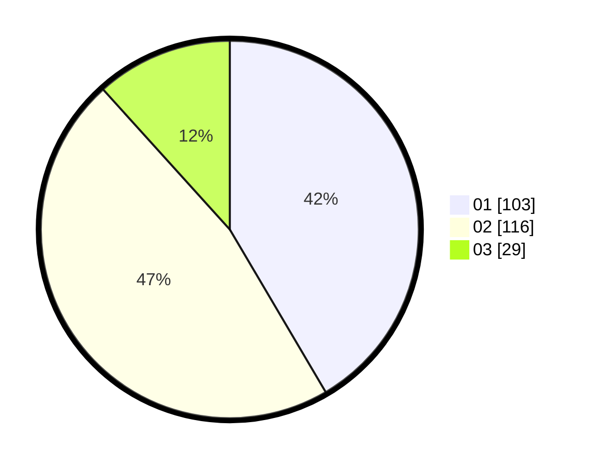

# Hasil

Hasil perolehan suara paslon dapat dilihat pada file paslon-01.txt, paslon-02.txt, dan paslon-03.txt.

Jika tidak ada, artinya data tersebut belum ada pada SIREKAP.

## Perolehan Suara

 * Paslon 01: **103**.
 * Paslon 02: **116**.
 * Paslon 03: **29**.

## Foto C Plano

https://sirekap-obj-formc.kpu.go.id/d925/pemilu/ppwp/31/74/04/10/07/3174041007084-20240214-225712--05b38301-f465-4154-b830-b8e7c78fde52.jpg

https://sirekap-obj-formc.kpu.go.id/d925/pemilu/ppwp/31/74/04/10/07/3174041007084-20240214-222157--64249704-7b9b-4e4b-8ff6-0f33b1f68c69.jpg

https://sirekap-obj-formc.kpu.go.id/d925/pemilu/ppwp/31/74/04/10/07/3174041007084-20240214-222232--bf306f89-c919-4582-9a9e-cce68124d3f4.jpg

## DATA PEMILIH TETAP

Jumlah pemilih dalam DPT: **284**.
 * L: **142**.
 * P: **142**.

## DATA PENGGUNA HAK PILIH

Jumlah pengguna hak pilih dalam DPT: **250**.
 * L: **126**.
 * P: **124**.

Jumlah pengguna hak pilih dalam DPTb: **1**.
 * L: **0**.
 * P: **1**.

Jumlah pengguna hak pilih dalam DPK: **2**.
 * L: **1**.
 * P: **1**.

Jumlah pengguna hak pilih: **253**.
 * L: **127**.
 * P: **126**.

## JUMLAH SUARA SAH DAN TIDAK SAH

JUMLAH SELURUH SUARA SAH: **248**.

JUMLAH SUARA TIDAK SAH: **5**.

JUMLAH SELURUH SUARA SAH DAN SUARA TIDAK SAH: **253**.
