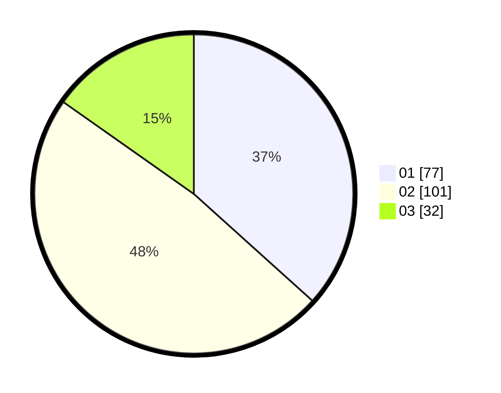

# Hasil

Hasil perolehan suara paslon dapat dilihat pada file paslon-01.txt, paslon-02.txt, dan paslon-03.txt.

Jika tidak ada, artinya data tersebut belum ada pada SIREKAP.

## Perolehan Suara

 * Paslon 01: **77**.
 * Paslon 02: **101**.
 * Paslon 03: **32**.

## Foto C Plano

https://sirekap-obj-formc.kpu.go.id/fe8f/pemilu/ppwp/31/74/04/10/07/3174041007103-20240216-142716--dda6b4fc-0e6f-4869-b015-2aed4a32259e.jpg

https://sirekap-obj-formc.kpu.go.id/fe8f/pemilu/ppwp/31/74/04/10/07/3174041007103-20240216-142717--fb170a28-55ca-4d55-a9e8-774f9081fbc6.jpg

https://sirekap-obj-formc.kpu.go.id/fe8f/pemilu/ppwp/31/74/04/10/07/3174041007103-20240214-221655--6d94ec40-760d-490d-a760-6bd8d0677a5e.jpg

## DATA PEMILIH TETAP

Jumlah pemilih dalam DPT: **242**.
 * L: **112**.
 * P: **130**.

## DATA PENGGUNA HAK PILIH

Jumlah pengguna hak pilih dalam DPT: **207**.
 * L: **96**.
 * P: **111**.

Jumlah pengguna hak pilih dalam DPTb: **3**.
 * L: **1**.
 * P: **2**.

Jumlah pengguna hak pilih dalam DPK: **5**.
 * L: **3**.
 * P: **2**.

Jumlah pengguna hak pilih: **215**.
 * L: **100**.
 * P: **115**.

## JUMLAH SUARA SAH DAN TIDAK SAH

JUMLAH SELURUH SUARA SAH: **210**.

JUMLAH SUARA TIDAK SAH: **5**.

JUMLAH SELURUH SUARA SAH DAN SUARA TIDAK SAH: **215**.
