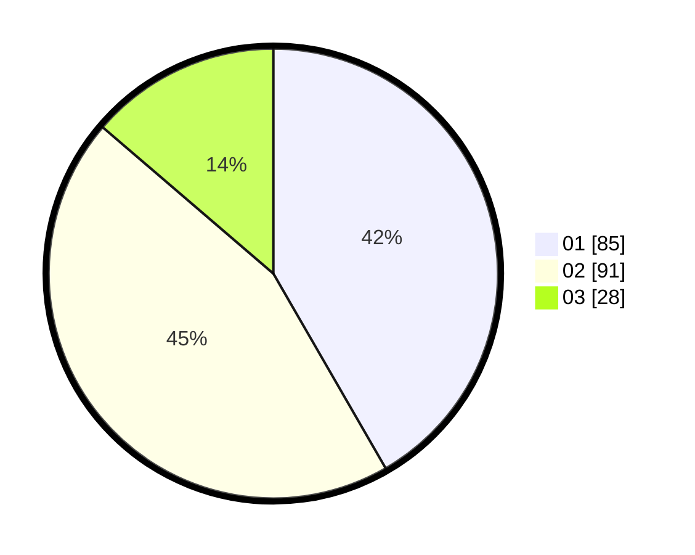

# Hasil

Hasil perolehan suara paslon dapat dilihat pada file paslon-01.txt, paslon-02.txt, dan paslon-03.txt.

Jika tidak ada, artinya data tersebut belum ada pada SIREKAP.

## Perolehan Suara

 * Paslon 01: **85**.
 * Paslon 02: **91**.
 * Paslon 03: **28**.

## Foto C Plano

https://sirekap-obj-formc.kpu.go.id/e7ea/pemilu/ppwp/31/74/04/10/07/3174041007104-20240216-031126--3d2f3dca-6d9f-4564-b7e0-23dd3a2d3c8c.jpg

https://sirekap-obj-formc.kpu.go.id/e7ea/pemilu/ppwp/31/74/04/10/07/3174041007104-20240216-031138--c06f1481-9a58-42ea-a4b7-835eb19da089.jpg

https://sirekap-obj-formc.kpu.go.id/e7ea/pemilu/ppwp/31/74/04/10/07/3174041007104-20240216-031127--a599c61d-b150-4da3-81bc-9b6de56ab2b5.jpg

## DATA PEMILIH TETAP

Jumlah pemilih dalam DPT: **251**.
 * L: **129**.
 * P: **122**.

## DATA PENGGUNA HAK PILIH

Jumlah pengguna hak pilih dalam DPT: **207**.
 * L: **105**.
 * P: **102**.

Jumlah pengguna hak pilih dalam DPTb: **0**.
 * L: **0**.
 * P: **0**.

Jumlah pengguna hak pilih dalam DPK: **1**.
 * L: **1**.
 * P: **0**.

Jumlah pengguna hak pilih: **208**.
 * L: **106**.
 * P: **102**.

## JUMLAH SUARA SAH DAN TIDAK SAH

JUMLAH SELURUH SUARA SAH: **204**.

JUMLAH SUARA TIDAK SAH: **4**.

JUMLAH SELURUH SUARA SAH DAN SUARA TIDAK SAH: **208**.
