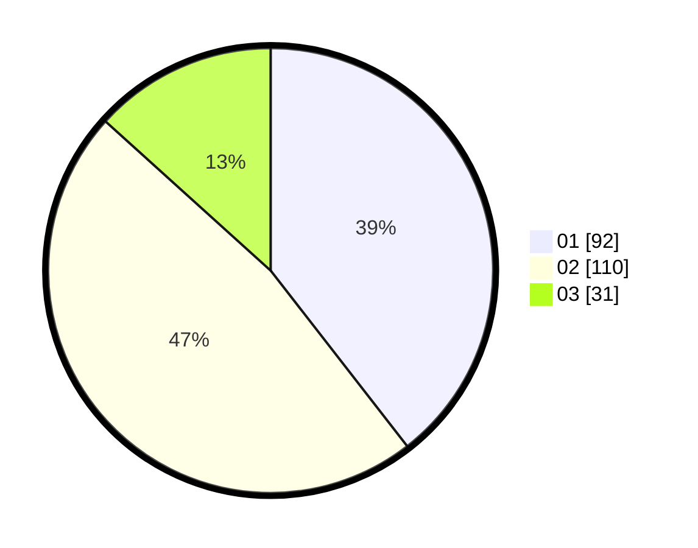

# Hasil

Hasil perolehan suara paslon dapat dilihat pada file paslon-01.txt, paslon-02.txt, dan paslon-03.txt.

Jika tidak ada, artinya data tersebut belum ada pada SIREKAP.

## Perolehan Suara

 * Paslon 01: **92**.
 * Paslon 02: **110**.
 * Paslon 03: **31**.

## Foto C Plano

https://sirekap-obj-formc.kpu.go.id/d580/pemilu/ppwp/31/74/04/10/07/3174041007123-20240214-190941--8931fbb2-db83-461d-be6f-dfc6a240e81d.jpg

https://sirekap-obj-formc.kpu.go.id/d580/pemilu/ppwp/31/74/04/10/07/3174041007123-20240214-190947--4790fe9e-47af-4a15-9752-57514e907f70.jpg

https://sirekap-obj-formc.kpu.go.id/d580/pemilu/ppwp/31/74/04/10/07/3174041007123-20240214-193442--a65b5014-8bec-43c8-9d1b-aa2ae422f58b.jpg

## DATA PEMILIH TETAP

Jumlah pemilih dalam DPT: **269**.
 * L: **134**.
 * P: **135**.

## DATA PENGGUNA HAK PILIH

Jumlah pengguna hak pilih dalam DPT: **229**.
 * L: **113**.
 * P: **116**.

Jumlah pengguna hak pilih dalam DPTb: **4**.
 * L: **2**.
 * P: **2**.

Jumlah pengguna hak pilih dalam DPK: **2**.
 * L: **0**.
 * P: **2**.

Jumlah pengguna hak pilih: **235**.
 * L: **115**.
 * P: **120**.

## JUMLAH SUARA SAH DAN TIDAK SAH

JUMLAH SELURUH SUARA SAH: **233**.

JUMLAH SUARA TIDAK SAH: **2**.

JUMLAH SELURUH SUARA SAH DAN SUARA TIDAK SAH: **235**.
