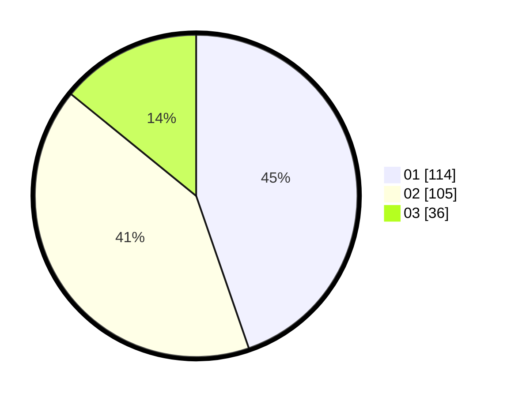

# Hasil

Hasil perolehan suara paslon dapat dilihat pada file paslon-01.txt, paslon-02.txt, dan paslon-03.txt.

Jika tidak ada, artinya data tersebut belum ada pada SIREKAP.

## Perolehan Suara

 * Paslon 01: **114**.
 * Paslon 02: **105**.
 * Paslon 03: **36**.

## Foto C Plano

https://sirekap-obj-formc.kpu.go.id/6133/pemilu/ppwp/31/74/04/10/07/3174041007132-20240214-191518--dc51f192-74f0-4f57-83e5-7c20a9813ae8.jpg

https://sirekap-obj-formc.kpu.go.id/6133/pemilu/ppwp/31/74/04/10/07/3174041007132-20240214-194325--ae6c6dd3-665f-4d13-9655-bb9bfa9a9c63.jpg

https://sirekap-obj-formc.kpu.go.id/6133/pemilu/ppwp/31/74/04/10/07/3174041007132-20240214-191854--88838c61-c204-4aaf-9ffc-73bcc0eb6ad6.jpg

## DATA PEMILIH TETAP

Jumlah pemilih dalam DPT: **286**.
 * L: **132**.
 * P: **154**.

## DATA PENGGUNA HAK PILIH

Jumlah pengguna hak pilih dalam DPT: **254**.
 * L: **116**.
 * P: **138**.

Jumlah pengguna hak pilih dalam DPTb: **0**.
 * L: **0**.
 * P: **0**.

Jumlah pengguna hak pilih dalam DPK: **3**.
 * L: **0**.
 * P: **3**.

Jumlah pengguna hak pilih: **257**.
 * L: **116**.
 * P: **141**.

## JUMLAH SUARA SAH DAN TIDAK SAH

JUMLAH SELURUH SUARA SAH: **255**.

JUMLAH SUARA TIDAK SAH: **2**.

JUMLAH SELURUH SUARA SAH DAN SUARA TIDAK SAH: **257**.
