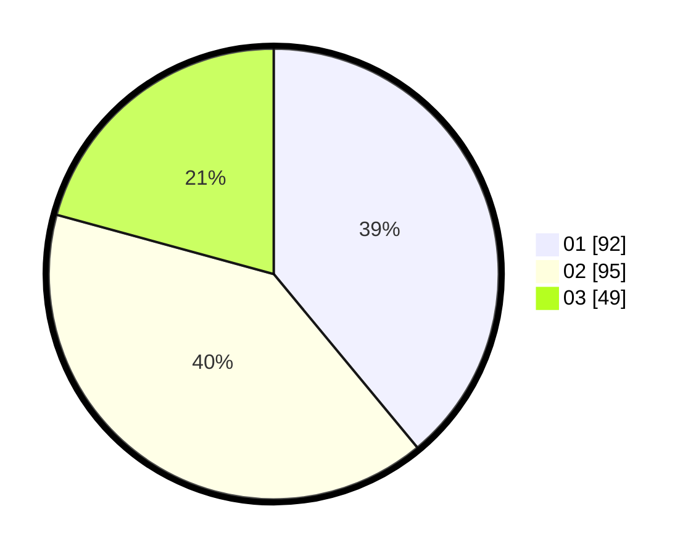

# Hasil

Hasil perolehan suara paslon dapat dilihat pada file paslon-01.txt, paslon-02.txt, dan paslon-03.txt.

Jika tidak ada, artinya data tersebut belum ada pada SIREKAP.

## Perolehan Suara

 * Paslon 01: **92**.
 * Paslon 02: **95**.
 * Paslon 03: **49**.

## Foto C Plano

https://sirekap-obj-formc.kpu.go.id/e5ab/pemilu/ppwp/31/74/04/10/07/3174041007133-20240214-190456--16d95cc0-c2eb-4e0c-bef7-f8bd25992423.jpg

https://sirekap-obj-formc.kpu.go.id/e5ab/pemilu/ppwp/31/74/04/10/07/3174041007133-20240214-192625--f61105e2-cf85-4b81-82cd-11460e3792b0.jpg

https://sirekap-obj-formc.kpu.go.id/e5ab/pemilu/ppwp/31/74/04/10/07/3174041007133-20240214-190837--b1b4e686-186b-49ae-9826-7837b63f7854.jpg

## DATA PEMILIH TETAP

Jumlah pemilih dalam DPT: **285**.
 * L: **141**.
 * P: **144**.

## DATA PENGGUNA HAK PILIH

Jumlah pengguna hak pilih dalam DPT: **233**.
 * L: **111**.
 * P: **122**.

Jumlah pengguna hak pilih dalam DPTb: **6**.
 * L: **3**.
 * P: **3**.

Jumlah pengguna hak pilih dalam DPK: **0**.
 * L: **0**.
 * P: **0**.

Jumlah pengguna hak pilih: **239**.
 * L: **114**.
 * P: **125**.

## JUMLAH SUARA SAH DAN TIDAK SAH

JUMLAH SELURUH SUARA SAH: **236**.

JUMLAH SUARA TIDAK SAH: **3**.

JUMLAH SELURUH SUARA SAH DAN SUARA TIDAK SAH: **239**.
