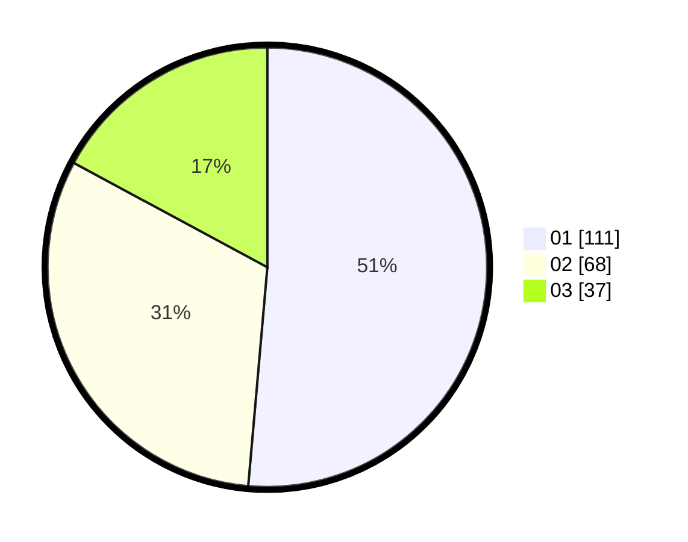

# Hasil

Hasil perolehan suara paslon dapat dilihat pada file paslon-01.txt, paslon-02.txt, dan paslon-03.txt.

Jika tidak ada, artinya data tersebut belum ada pada SIREKAP.

## Perolehan Suara

 * Paslon 01: **111**.
 * Paslon 02: **68**.
 * Paslon 03: **37**.

## Foto C Plano

https://sirekap-obj-formc.kpu.go.id/e5d5/pemilu/ppwp/31/74/04/10/07/3174041007135-20240214-204342--fd003136-2b4f-446c-922b-5cd34a6e2349.jpg

https://sirekap-obj-formc.kpu.go.id/e5d5/pemilu/ppwp/31/74/04/10/07/3174041007135-20240214-194201--4f5fe68e-2ffb-4e18-a418-54dd8b875a9e.jpg
