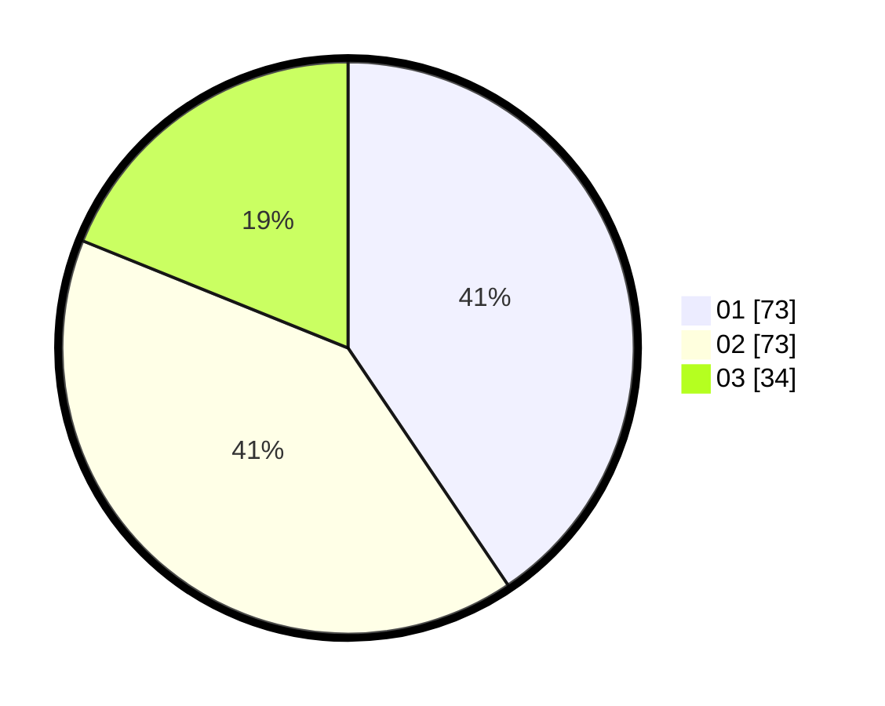

# Hasil

Hasil perolehan suara paslon dapat dilihat pada file paslon-01.txt, paslon-02.txt, dan paslon-03.txt.

Jika tidak ada, artinya data tersebut belum ada pada SIREKAP.

## Perolehan Suara

 * Paslon 01: **73**.
 * Paslon 02: **73**.
 * Paslon 03: **34**.

## Foto C Plano

https://sirekap-obj-formc.kpu.go.id/d1ee/pemilu/ppwp/31/74/04/10/07/3174041007142-20240214-193729--4b820c0d-8ded-4c5d-bb3a-feb83c3459af.jpg

https://sirekap-obj-formc.kpu.go.id/d1ee/pemilu/ppwp/31/74/04/10/07/3174041007142-20240214-193859--d4f53582-7fd3-4f82-ade2-c19e1971d086.jpg

https://sirekap-obj-formc.kpu.go.id/d1ee/pemilu/ppwp/31/74/04/10/07/3174041007142-20240214-194035--0dc7b7e6-5530-4fba-8ec5-82ef835d3152.jpg

## DATA PEMILIH TETAP

Jumlah pemilih dalam DPT: **223**.
 * L: **112**.
 * P: **111**.

## DATA PENGGUNA HAK PILIH

Jumlah pengguna hak pilih dalam DPT: **182**.
 * L: **85**.
 * P: **97**.

Jumlah pengguna hak pilih dalam DPTb: **0**.
 * L: **0**.
 * P: **0**.

Jumlah pengguna hak pilih dalam DPK: **2**.
 * L: **1**.
 * P: **1**.

Jumlah pengguna hak pilih: **184**.
 * L: **86**.
 * P: **98**.

## JUMLAH SUARA SAH DAN TIDAK SAH

JUMLAH SELURUH SUARA SAH: **180**.

JUMLAH SUARA TIDAK SAH: **4**.

JUMLAH SELURUH SUARA SAH DAN SUARA TIDAK SAH: **184**.
