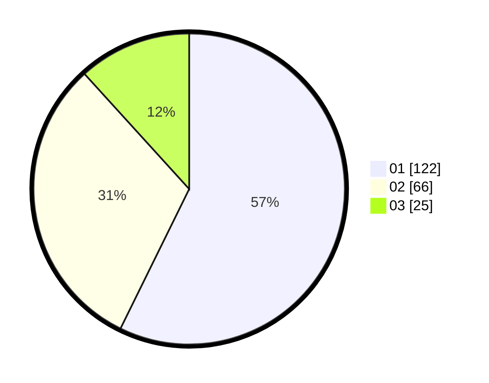

# Hasil

Hasil perolehan suara paslon dapat dilihat pada file paslon-01.txt, paslon-02.txt, dan paslon-03.txt.

Jika tidak ada, artinya data tersebut belum ada pada SIREKAP.

## Perolehan Suara

 * Paslon 01: **122**.
 * Paslon 02: **66**.
 * Paslon 03: **25**.

## Foto C Plano

https://sirekap-obj-formc.kpu.go.id/fac3/pemilu/ppwp/31/74/04/10/07/3174041007145-20240214-191822--d435b915-86a1-44a8-8fb5-5972aa249db3.jpg

https://sirekap-obj-formc.kpu.go.id/fac3/pemilu/ppwp/31/74/04/10/07/3174041007145-20240214-192029--63b4194e-439b-45b9-8e9b-e4f6cf9aeefc.jpg

https://sirekap-obj-formc.kpu.go.id/fac3/pemilu/ppwp/31/74/04/10/07/3174041007145-20240214-192126--7908f1b6-cd42-413d-8329-bee081a3c82e.jpg

## DATA PEMILIH TETAP

Jumlah pemilih dalam DPT: **284**.
 * L: **142**.
 * P: **142**.

## DATA PENGGUNA HAK PILIH

Jumlah pengguna hak pilih dalam DPT: **205**.
 * L: **97**.
 * P: **108**.

Jumlah pengguna hak pilih dalam DPTb: **9**.
 * L: **3**.
 * P: **6**.

Jumlah pengguna hak pilih dalam DPK: **0**.
 * L: **0**.
 * P: **0**.

Jumlah pengguna hak pilih: **214**.
 * L: **100**.
 * P: **114**.

## JUMLAH SUARA SAH DAN TIDAK SAH

JUMLAH SELURUH SUARA SAH: **213**.

JUMLAH SUARA TIDAK SAH: **1**.

JUMLAH SELURUH SUARA SAH DAN SUARA TIDAK SAH: **214**.
