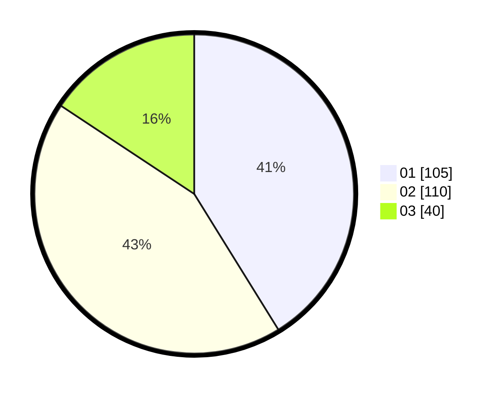

# Hasil

Hasil perolehan suara paslon dapat dilihat pada file paslon-01.txt, paslon-02.txt, dan paslon-03.txt.

Jika tidak ada, artinya data tersebut belum ada pada SIREKAP.

## Perolehan Suara

 * Paslon 01: **105**.
 * Paslon 02: **110**.
 * Paslon 03: **40**.

## Foto C Plano

https://sirekap-obj-formc.kpu.go.id/c604/pemilu/ppwp/31/74/04/10/07/3174041007160-20240214-192731--0bfeebdf-d466-45d5-b849-f05d4e327e1b.jpg

https://sirekap-obj-formc.kpu.go.id/c604/pemilu/ppwp/31/74/04/10/07/3174041007160-20240214-192840--031b1149-95cc-471d-a84a-879a8644439a.jpg

https://sirekap-obj-formc.kpu.go.id/c604/pemilu/ppwp/31/74/04/10/07/3174041007160-20240214-155510--d3c80faa-9520-4d22-9055-e51480dc6fe0.jpg

## DATA PEMILIH TETAP

Jumlah pemilih dalam DPT: **285**.
 * L: **137**.
 * P: **148**.

## DATA PENGGUNA HAK PILIH

Jumlah pengguna hak pilih dalam DPT: **249**.
 * L: **777**.
 * P: **132**.

Jumlah pengguna hak pilih dalam DPTb: **8**.
 * L: **4**.
 * P: **4**.

Jumlah pengguna hak pilih dalam DPK: **1**.
 * L: **1**.
 * P: **0**.

Jumlah pengguna hak pilih: **258**.
 * L: **122**.
 * P: **136**.

## JUMLAH SUARA SAH DAN TIDAK SAH

JUMLAH SELURUH SUARA SAH: **255**.

JUMLAH SUARA TIDAK SAH: **3**.

JUMLAH SELURUH SUARA SAH DAN SUARA TIDAK SAH: **258**.
