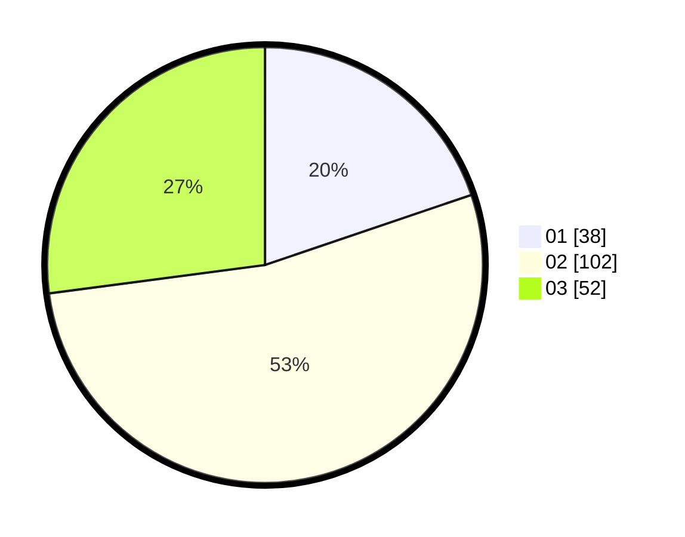

# Hasil

Hasil perolehan suara paslon dapat dilihat pada file paslon-01.txt, paslon-02.txt, dan paslon-03.txt.

Jika tidak ada, artinya data tersebut belum ada pada SIREKAP.

## Perolehan Suara

 * Paslon 01: **38**.
 * Paslon 02: **102**.
 * Paslon 03: **52**.

## Foto C Plano

https://sirekap-obj-formc.kpu.go.id/4259/pemilu/ppwp/31/74/05/10/01/3174051001001-20240214-192722--832a4f7f-a77c-4bea-90b0-4ce3e16f1f52.jpg

https://sirekap-obj-formc.kpu.go.id/4259/pemilu/ppwp/31/74/05/10/01/3174051001001-20240214-192800--6bfcb647-03be-463d-8fa9-cf47be9f3984.jpg

https://sirekap-obj-formc.kpu.go.id/4259/pemilu/ppwp/31/74/05/10/01/3174051001001-20240214-192805--9c8612a5-a424-41a6-bb02-55b33341ef1f.jpg

## DATA PEMILIH TETAP

Jumlah pemilih dalam DPT: **258**.
 * L: **124**.
 * P: **134**.

## DATA PENGGUNA HAK PILIH

Jumlah pengguna hak pilih dalam DPT: **187**.
 * L: **93**.
 * P: **94**.

Jumlah pengguna hak pilih dalam DPTb: **6**.
 * L: **2**.
 * P: **4**.

Jumlah pengguna hak pilih dalam DPK: **0**.
 * L: **0**.
 * P: **0**.

Jumlah pengguna hak pilih: **193**.
 * L: **95**.
 * P: **98**.

## JUMLAH SUARA SAH DAN TIDAK SAH

JUMLAH SELURUH SUARA SAH: **192**.

JUMLAH SUARA TIDAK SAH: **1**.

JUMLAH SELURUH SUARA SAH DAN SUARA TIDAK SAH: **193**.
