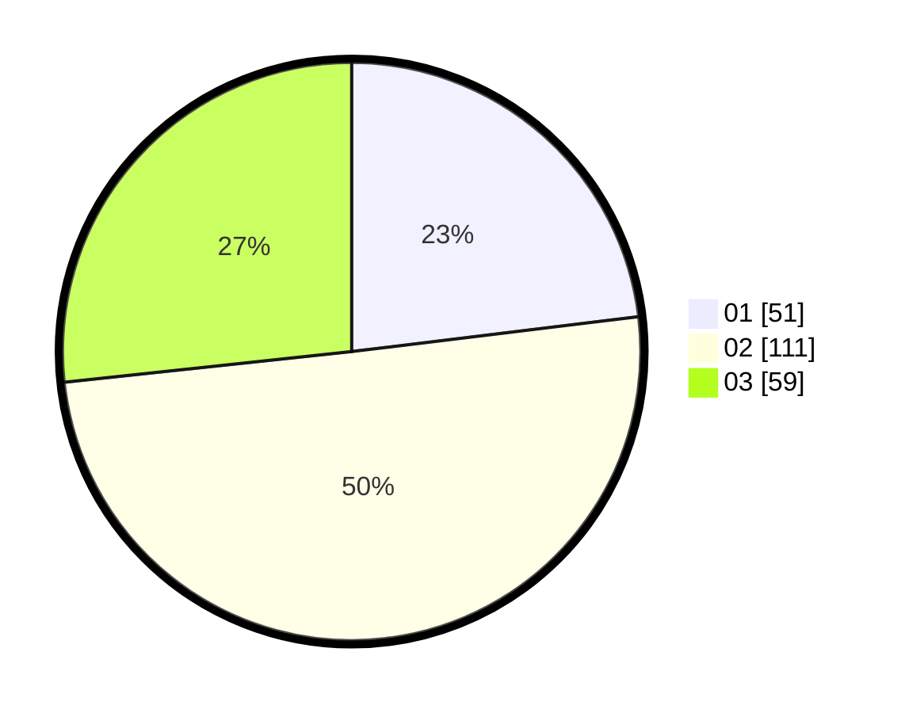

# Hasil

Hasil perolehan suara paslon dapat dilihat pada file paslon-01.txt, paslon-02.txt, dan paslon-03.txt.

Jika tidak ada, artinya data tersebut belum ada pada SIREKAP.

## Perolehan Suara

 * Paslon 01: **51**.
 * Paslon 02: **111**.
 * Paslon 03: **59**.

## Foto C Plano

https://sirekap-obj-formc.kpu.go.id/9b0e/pemilu/ppwp/31/74/05/10/01/3174051001004-20240215-195445--debe670a-e816-404d-9567-24fa2699b60a.jpg

https://sirekap-obj-formc.kpu.go.id/9b0e/pemilu/ppwp/31/74/05/10/01/3174051001004-20240215-195500--10281128-77d6-4002-988c-f766855067de.jpg

https://sirekap-obj-formc.kpu.go.id/9b0e/pemilu/ppwp/31/74/05/10/01/3174051001004-20240215-195508--4ab27ede-de42-4281-bfb5-6095c1bf8442.jpg

## DATA PEMILIH TETAP

Jumlah pemilih dalam DPT: **288**.
 * L: **140**.
 * P: **148**.

## DATA PENGGUNA HAK PILIH

Jumlah pengguna hak pilih dalam DPT: **220**.
 * L: **95**.
 * P: **125**.

Jumlah pengguna hak pilih dalam DPTb: **3**.
 * L: **2**.
 * P: **1**.

Jumlah pengguna hak pilih dalam DPK: **0**.
 * L: **0**.
 * P: **0**.

Jumlah pengguna hak pilih: **223**.
 * L: **97**.
 * P: **126**.

## JUMLAH SUARA SAH DAN TIDAK SAH

JUMLAH SELURUH SUARA SAH: **221**.

JUMLAH SUARA TIDAK SAH: **2**.

JUMLAH SELURUH SUARA SAH DAN SUARA TIDAK SAH: **223**.
