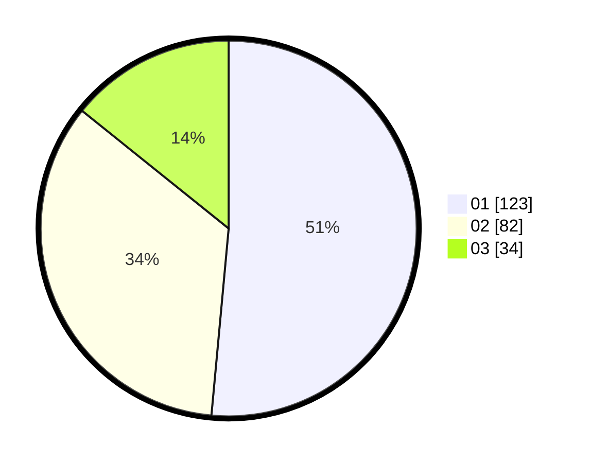

# Hasil

Hasil perolehan suara paslon dapat dilihat pada file paslon-01.txt, paslon-02.txt, dan paslon-03.txt.

Jika tidak ada, artinya data tersebut belum ada pada SIREKAP.

## Perolehan Suara

 * Paslon 01: **123**.
 * Paslon 02: **82**.
 * Paslon 03: **34**.

## Foto C Plano

https://sirekap-obj-formc.kpu.go.id/edad/pemilu/ppwp/31/74/05/10/01/3174051001015-20240218-114435--ac8b6483-3532-4273-acc3-65c25758f955.jpg

https://sirekap-obj-formc.kpu.go.id/edad/pemilu/ppwp/31/74/05/10/01/3174051001015-20240218-114531--70c4b23e-60cc-46a1-9b09-b8119afdac6d.jpg

https://sirekap-obj-formc.kpu.go.id/edad/pemilu/ppwp/31/74/05/10/01/3174051001015-20240218-114650--f3fc1562-7e5b-4230-b7a8-da283cc4cb7a.jpg

## DATA PEMILIH TETAP

Jumlah pemilih dalam DPT: **251**.
 * L: **172**.
 * P: **557**.

## DATA PENGGUNA HAK PILIH

Jumlah pengguna hak pilih dalam DPT: **229**.
 * L: **773**.
 * P: **125**.

Jumlah pengguna hak pilih dalam DPTb: **17**.
 * L: **5**.
 * P: **8**.

Jumlah pengguna hak pilih dalam DPK: **2**.
 * L: **1**.
 * P: **1**.

Jumlah pengguna hak pilih: **244**.
 * L: **105**.
 * P: **175**.

## JUMLAH SUARA SAH DAN TIDAK SAH

JUMLAH SELURUH SUARA SAH: **239**.

JUMLAH SUARA TIDAK SAH: **5**.

JUMLAH SELURUH SUARA SAH DAN SUARA TIDAK SAH: **244**.
