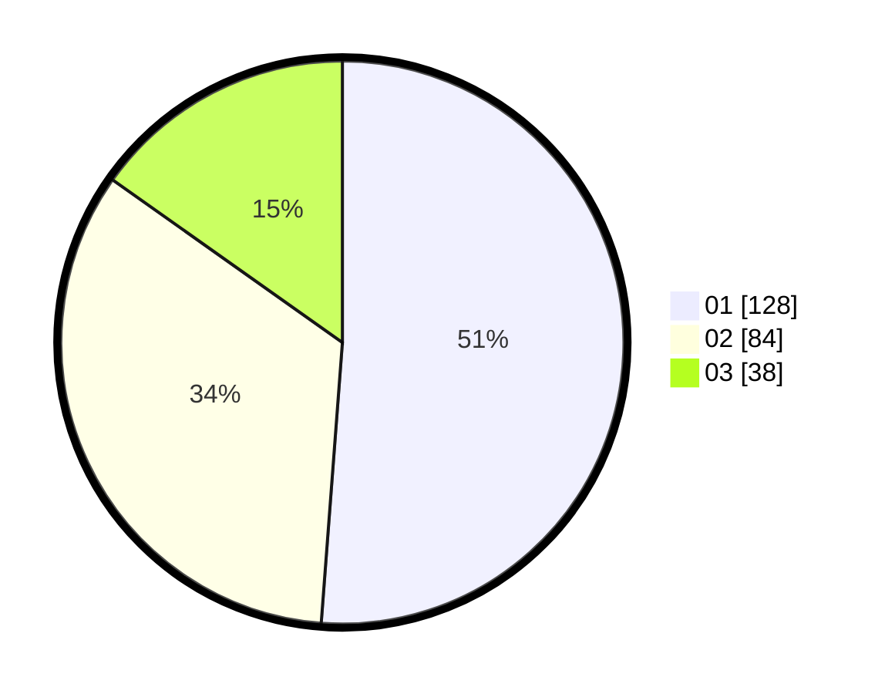

# Hasil

Hasil perolehan suara paslon dapat dilihat pada file paslon-01.txt, paslon-02.txt, dan paslon-03.txt.

Jika tidak ada, artinya data tersebut belum ada pada SIREKAP.

## Perolehan Suara

 * Paslon 01: **128**.
 * Paslon 02: **84**.
 * Paslon 03: **38**.

## Foto C Plano

https://sirekap-obj-formc.kpu.go.id/1e41/pemilu/ppwp/31/74/05/10/01/3174051001022-20240218-173905--c9cb6fad-97ef-4701-a8e0-a66c2d8ecb47.jpg

https://sirekap-obj-formc.kpu.go.id/1e41/pemilu/ppwp/31/74/05/10/01/3174051001022-20240218-173948--ffac38b7-3cf2-4db1-90b0-a8b54b8565e1.jpg

https://sirekap-obj-formc.kpu.go.id/1e41/pemilu/ppwp/31/74/05/10/01/3174051001022-20240218-174015--563b1e12-ba62-4fcc-980e-55fb4fdb9fa4.jpg

## DATA PEMILIH TETAP

Jumlah pemilih dalam DPT: **293**.
 * L: **154**.
 * P: **139**.

## DATA PENGGUNA HAK PILIH

Jumlah pengguna hak pilih dalam DPT: **247**.
 * L: **129**.
 * P: **118**.

Jumlah pengguna hak pilih dalam DPTb: **6**.
 * L: **2**.
 * P: **4**.

Jumlah pengguna hak pilih dalam DPK: **0**.
 * L: **0**.
 * P: **0**.

Jumlah pengguna hak pilih: **253**.
 * L: **131**.
 * P: **122**.

## JUMLAH SUARA SAH DAN TIDAK SAH

JUMLAH SELURUH SUARA SAH: **250**.

JUMLAH SUARA TIDAK SAH: **3**.

JUMLAH SELURUH SUARA SAH DAN SUARA TIDAK SAH: **253**.
