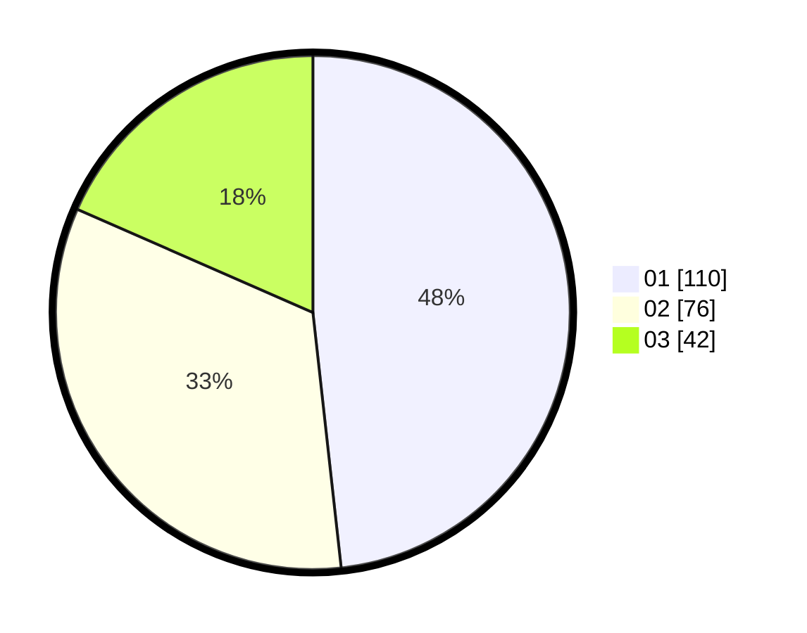

# Hasil

Hasil perolehan suara paslon dapat dilihat pada file paslon-01.txt, paslon-02.txt, dan paslon-03.txt.

Jika tidak ada, artinya data tersebut belum ada pada SIREKAP.

## Perolehan Suara

 * Paslon 01: **110**.
 * Paslon 02: **76**.
 * Paslon 03: **42**.

## Foto C Plano

https://sirekap-obj-formc.kpu.go.id/8768/pemilu/ppwp/31/74/05/10/01/3174051001023-20240215-023914--1e88f4dd-9f73-4a89-8c70-90be9cd31c7c.jpg

https://sirekap-obj-formc.kpu.go.id/8768/pemilu/ppwp/31/74/05/10/01/3174051001023-20240214-185754--9b0941cc-7007-46a7-b03c-9d0f831c47bb.jpg

https://sirekap-obj-formc.kpu.go.id/8768/pemilu/ppwp/31/74/05/10/01/3174051001023-20240215-024103--80f2a128-80c3-49f5-9984-e37c08cc5f9f.jpg

## DATA PEMILIH TETAP

Jumlah pemilih dalam DPT: **282**.
 * L: **132**.
 * P: **150**.

## DATA PENGGUNA HAK PILIH

Jumlah pengguna hak pilih dalam DPT: **229**.
 * L: **103**.
 * P: **126**.

Jumlah pengguna hak pilih dalam DPTb: **1**.
 * L: **0**.
 * P: **1**.

Jumlah pengguna hak pilih dalam DPK: **1**.
 * L: **1**.
 * P: **0**.

Jumlah pengguna hak pilih: **230**.
 * L: **104**.
 * P: **127**.

## JUMLAH SUARA SAH DAN TIDAK SAH

JUMLAH SELURUH SUARA SAH: **228**.

JUMLAH SUARA TIDAK SAH: **3**.

JUMLAH SELURUH SUARA SAH DAN SUARA TIDAK SAH: **231**.
