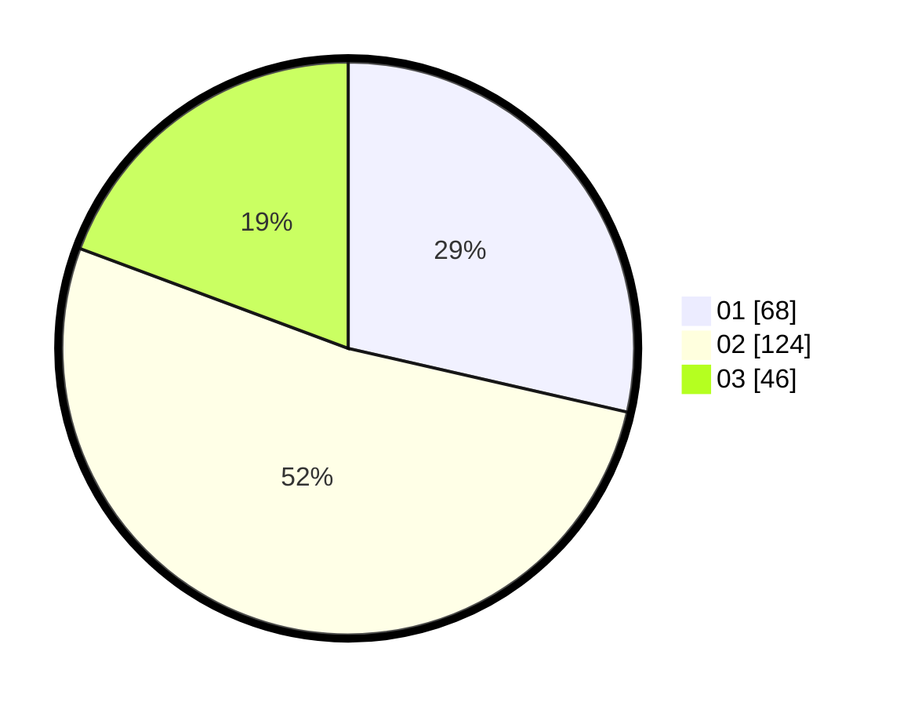

# Hasil

Hasil perolehan suara paslon dapat dilihat pada file paslon-01.txt, paslon-02.txt, dan paslon-03.txt.

Jika tidak ada, artinya data tersebut belum ada pada SIREKAP.

## Perolehan Suara

 * Paslon 01: **68**.
 * Paslon 02: **124**.
 * Paslon 03: **46**.

## Foto C Plano

https://sirekap-obj-formc.kpu.go.id/2223/pemilu/ppwp/31/74/05/10/01/3174051001034-20240214-195211--cedba278-bd6f-4e7b-926e-bfe36cf20ff1.jpg

https://sirekap-obj-formc.kpu.go.id/2223/pemilu/ppwp/31/74/05/10/01/3174051001034-20240214-205852--7bcccd43-09d1-4d66-a781-9c345f20caff.jpg

https://sirekap-obj-formc.kpu.go.id/2223/pemilu/ppwp/31/74/05/10/01/3174051001034-20240214-195216--d73d2af2-64ad-4aae-8fa7-5499b1ebfc04.jpg

## DATA PEMILIH TETAP

Jumlah pemilih dalam DPT: **290**.
 * L: **132**.
 * P: **158**.

## DATA PENGGUNA HAK PILIH

Jumlah pengguna hak pilih dalam DPT: **238**.
 * L: **112**.
 * P: **126**.

Jumlah pengguna hak pilih dalam DPTb: **1**.
 * L: **1**.
 * P: **0**.

Jumlah pengguna hak pilih dalam DPK: **1**.
 * L: **0**.
 * P: **1**.

Jumlah pengguna hak pilih: **240**.
 * L: **113**.
 * P: **127**.

## JUMLAH SUARA SAH DAN TIDAK SAH

JUMLAH SELURUH SUARA SAH: **238**.

JUMLAH SUARA TIDAK SAH: **2**.

JUMLAH SELURUH SUARA SAH DAN SUARA TIDAK SAH: **240**.
