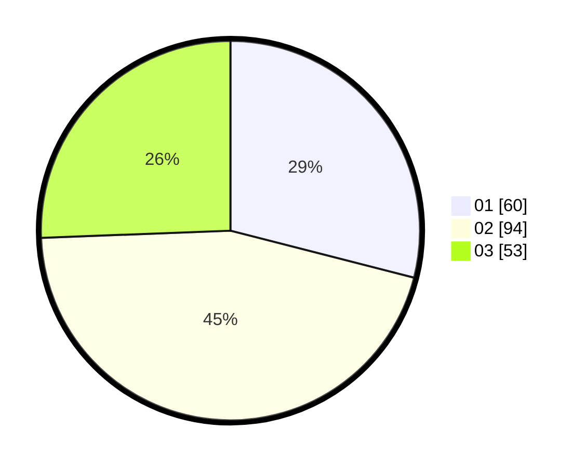

# Hasil

Hasil perolehan suara paslon dapat dilihat pada file paslon-01.txt, paslon-02.txt, dan paslon-03.txt.

Jika tidak ada, artinya data tersebut belum ada pada SIREKAP.

## Perolehan Suara

 * Paslon 01: **60**.
 * Paslon 02: **94**.
 * Paslon 03: **53**.

## Foto C Plano

https://sirekap-obj-formc.kpu.go.id/f0f9/pemilu/ppwp/31/74/05/10/01/3174051001039-20240214-155802--84b01434-ac22-4273-ade5-b1b8bcaa9f22.jpg

https://sirekap-obj-formc.kpu.go.id/f0f9/pemilu/ppwp/31/74/05/10/01/3174051001039-20240214-185500--4fd21707-c0b9-4d04-b713-9a8a5981f51a.jpg

https://sirekap-obj-formc.kpu.go.id/f0f9/pemilu/ppwp/31/74/05/10/01/3174051001039-20240214-181258--f65f3066-19a8-4712-90a5-cf57d733a4ee.jpg

## DATA PEMILIH TETAP

Jumlah pemilih dalam DPT: **283**.
 * L: **165**.
 * P: **118**.

## DATA PENGGUNA HAK PILIH

Jumlah pengguna hak pilih dalam DPT: **206**.
 * L: **114**.
 * P: **92**.

Jumlah pengguna hak pilih dalam DPTb: **2**.
 * L: **2**.
 * P: **0**.

Jumlah pengguna hak pilih dalam DPK: **0**.
 * L: **0**.
 * P: **0**.

Jumlah pengguna hak pilih: **208**.
 * L: **116**.
 * P: **92**.

## JUMLAH SUARA SAH DAN TIDAK SAH

JUMLAH SELURUH SUARA SAH: **207**.

JUMLAH SUARA TIDAK SAH: **1**.

JUMLAH SELURUH SUARA SAH DAN SUARA TIDAK SAH: **208**.
