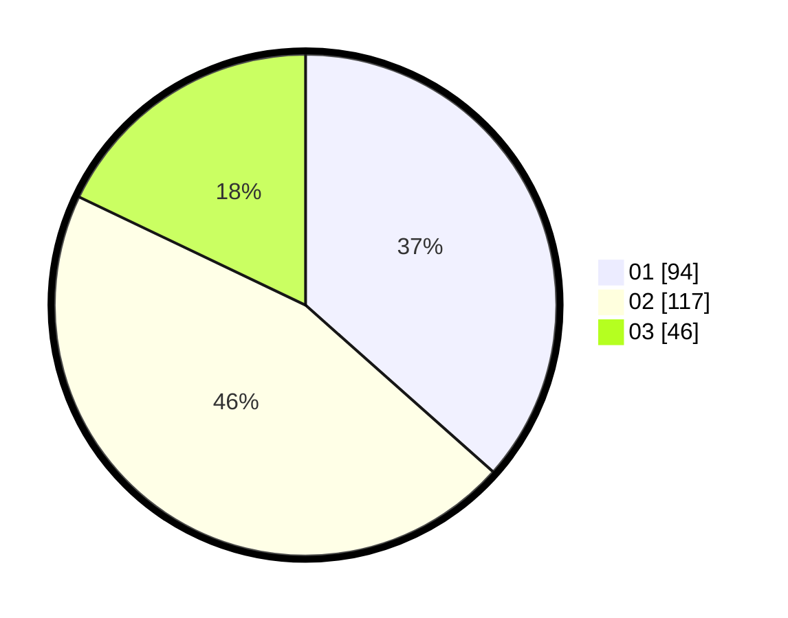

# Hasil

Hasil perolehan suara paslon dapat dilihat pada file paslon-01.txt, paslon-02.txt, dan paslon-03.txt.

Jika tidak ada, artinya data tersebut belum ada pada SIREKAP.

## Perolehan Suara

 * Paslon 01: **94**.
 * Paslon 02: **117**.
 * Paslon 03: **46**.

## Foto C Plano

https://sirekap-obj-formc.kpu.go.id/a116/pemilu/ppwp/31/74/05/10/01/3174051001060-20240214-195701--220a2145-d7c9-45f1-b613-c96bf4c12046.jpg

https://sirekap-obj-formc.kpu.go.id/a116/pemilu/ppwp/31/74/05/10/01/3174051001060-20240214-195758--6002fa96-8e0d-4b42-bda7-f66bc54c80a2.jpg

https://sirekap-obj-formc.kpu.go.id/a116/pemilu/ppwp/31/74/05/10/01/3174051001060-20240214-195848--7fca6b2c-ee8d-44a0-b256-5837533a4427.jpg

## DATA PEMILIH TETAP

Jumlah pemilih dalam DPT: **299**.
 * L: **138**.
 * P: **161**.

## DATA PENGGUNA HAK PILIH

Jumlah pengguna hak pilih dalam DPT: **250**.
 * L: **117**.
 * P: **133**.

Jumlah pengguna hak pilih dalam DPTb: **5**.
 * L: **1**.
 * P: **4**.

Jumlah pengguna hak pilih dalam DPK: **3**.
 * L: **2**.
 * P: **1**.

Jumlah pengguna hak pilih: **258**.
 * L: **120**.
 * P: **138**.

## JUMLAH SUARA SAH DAN TIDAK SAH

JUMLAH SELURUH SUARA SAH: **257**.

JUMLAH SUARA TIDAK SAH: **1**.

JUMLAH SELURUH SUARA SAH DAN SUARA TIDAK SAH: **258**.
