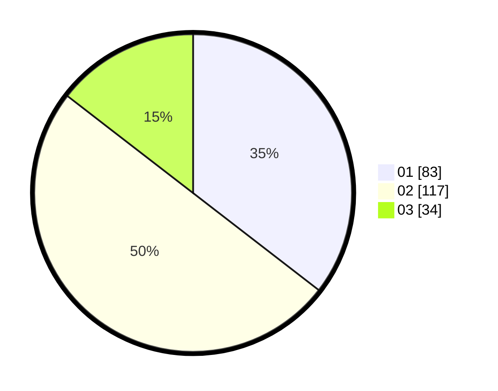

# Hasil

Hasil perolehan suara paslon dapat dilihat pada file paslon-01.txt, paslon-02.txt, dan paslon-03.txt.

Jika tidak ada, artinya data tersebut belum ada pada SIREKAP.

## Perolehan Suara

 * Paslon 01: **83**.
 * Paslon 02: **117**.
 * Paslon 03: **34**.

## Foto C Plano

https://sirekap-obj-formc.kpu.go.id/7659/pemilu/ppwp/31/74/05/10/01/3174051001066-20240216-220117--392dc8f1-a287-48ef-bfbd-6f738eb5e944.jpg

https://sirekap-obj-formc.kpu.go.id/7659/pemilu/ppwp/31/74/05/10/01/3174051001066-20240216-220119--bb7b1705-2873-4578-a984-775c2f5ba7d7.jpg

https://sirekap-obj-formc.kpu.go.id/7659/pemilu/ppwp/31/74/05/10/01/3174051001066-20240216-220118--9cf5f7b8-71c6-42b2-86f8-55f688ecbe22.jpg

## DATA PEMILIH TETAP

Jumlah pemilih dalam DPT: **288**.
 * L: **151**.
 * P: **137**.

## DATA PENGGUNA HAK PILIH

Jumlah pengguna hak pilih dalam DPT: **239**.
 * L: **117**.
 * P: **122**.

Jumlah pengguna hak pilih dalam DPTb: **0**.
 * L: **0**.
 * P: **0**.

Jumlah pengguna hak pilih dalam DPK: **2**.
 * L: **1**.
 * P: **1**.

Jumlah pengguna hak pilih: **241**.
 * L: **118**.
 * P: **123**.

## JUMLAH SUARA SAH DAN TIDAK SAH

JUMLAH SELURUH SUARA SAH: **234**.

JUMLAH SUARA TIDAK SAH: **7**.

JUMLAH SELURUH SUARA SAH DAN SUARA TIDAK SAH: **241**.
