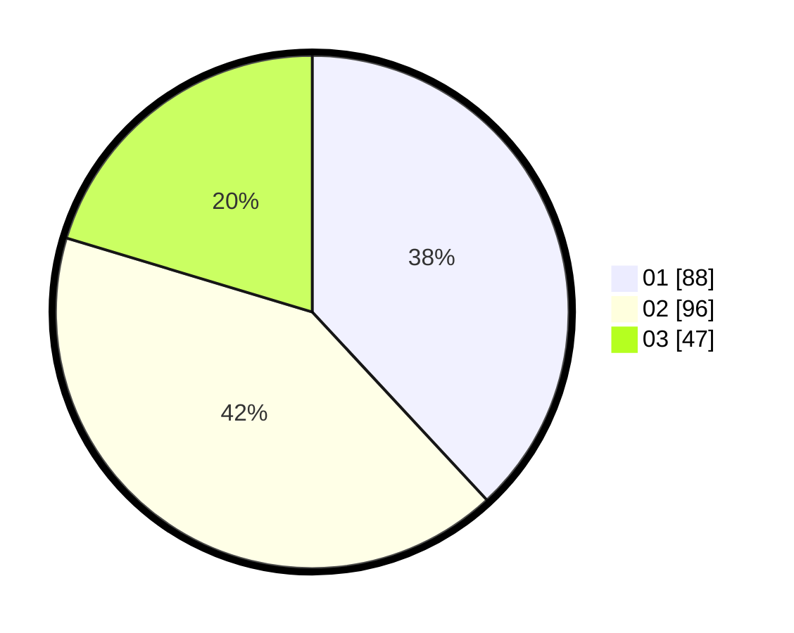

# Hasil

Hasil perolehan suara paslon dapat dilihat pada file paslon-01.txt, paslon-02.txt, dan paslon-03.txt.

Jika tidak ada, artinya data tersebut belum ada pada SIREKAP.

## Perolehan Suara

 * Paslon 01: **88**.
 * Paslon 02: **96**.
 * Paslon 03: **47**.

## Foto C Plano

https://sirekap-obj-formc.kpu.go.id/0058/pemilu/ppwp/31/74/05/10/01/3174051001067-20240216-152607--25e60b73-cc50-4e0a-b39c-d65dbaa79b1d.jpg

https://sirekap-obj-formc.kpu.go.id/0058/pemilu/ppwp/31/74/05/10/01/3174051001067-20240216-152608--44d5d8ce-3bbd-41db-b507-797161b97b84.jpg

https://sirekap-obj-formc.kpu.go.id/0058/pemilu/ppwp/31/74/05/10/01/3174051001067-20240216-152608--c91b6c73-e181-4ff4-9c39-946f710e221a.jpg

## DATA PEMILIH TETAP

Jumlah pemilih dalam DPT: **275**.
 * L: **135**.
 * P: **140**.

## DATA PENGGUNA HAK PILIH

Jumlah pengguna hak pilih dalam DPT: **232**.
 * L: **112**.
 * P: **120**.

Jumlah pengguna hak pilih dalam DPTb: **0**.
 * L: **0**.
 * P: **0**.

Jumlah pengguna hak pilih dalam DPK: **2**.
 * L: **1**.
 * P: **1**.

Jumlah pengguna hak pilih: **234**.
 * L: **113**.
 * P: **121**.

## JUMLAH SUARA SAH DAN TIDAK SAH

JUMLAH SELURUH SUARA SAH: **231**.

JUMLAH SUARA TIDAK SAH: **3**.

JUMLAH SELURUH SUARA SAH DAN SUARA TIDAK SAH: **234**.
