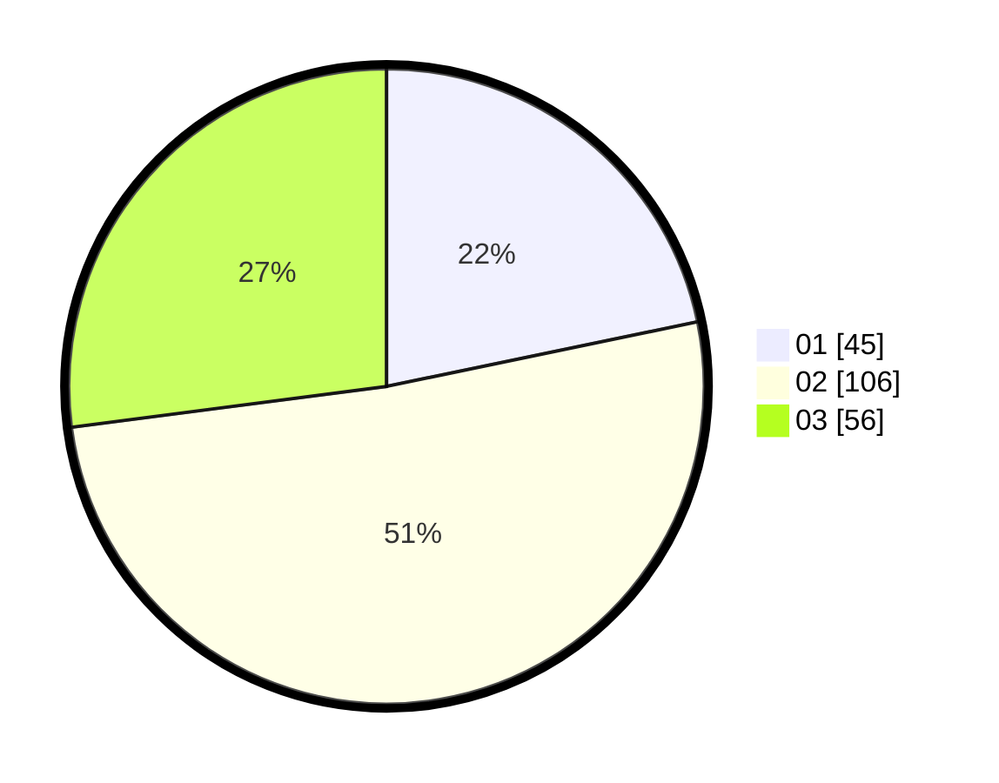

# Hasil

Hasil perolehan suara paslon dapat dilihat pada file paslon-01.txt, paslon-02.txt, dan paslon-03.txt.

Jika tidak ada, artinya data tersebut belum ada pada SIREKAP.

## Perolehan Suara

 * Paslon 01: **45**.
 * Paslon 02: **106**.
 * Paslon 03: **56**.

## Foto C Plano

https://sirekap-obj-formc.kpu.go.id/e0cc/pemilu/ppwp/31/74/05/10/01/3174051001077-20240216-052227--55db4f0f-c202-49f8-9d8c-0fb84b23e840.jpg

https://sirekap-obj-formc.kpu.go.id/e0cc/pemilu/ppwp/31/74/05/10/01/3174051001077-20240216-042637--16509f51-1b08-4649-aeeb-fa097979f498.jpg

https://sirekap-obj-formc.kpu.go.id/e0cc/pemilu/ppwp/31/74/05/10/01/3174051001077-20240216-042631--7ec4aec5-571a-4a6a-97eb-6bd38ec0d58c.jpg

## DATA PEMILIH TETAP

Jumlah pemilih dalam DPT: **268**.
 * L: **139**.
 * P: **129**.

## DATA PENGGUNA HAK PILIH

Jumlah pengguna hak pilih dalam DPT: **212**.
 * L: **107**.
 * P: **105**.

Jumlah pengguna hak pilih dalam DPTb: **4**.
 * L: **2**.
 * P: **2**.

Jumlah pengguna hak pilih dalam DPK: **0**.
 * L: **0**.
 * P: **0**.

Jumlah pengguna hak pilih: **216**.
 * L: **109**.
 * P: **107**.

## JUMLAH SUARA SAH DAN TIDAK SAH

JUMLAH SELURUH SUARA SAH: **208**.

JUMLAH SUARA TIDAK SAH: **8**.

JUMLAH SELURUH SUARA SAH DAN SUARA TIDAK SAH: **216**.
