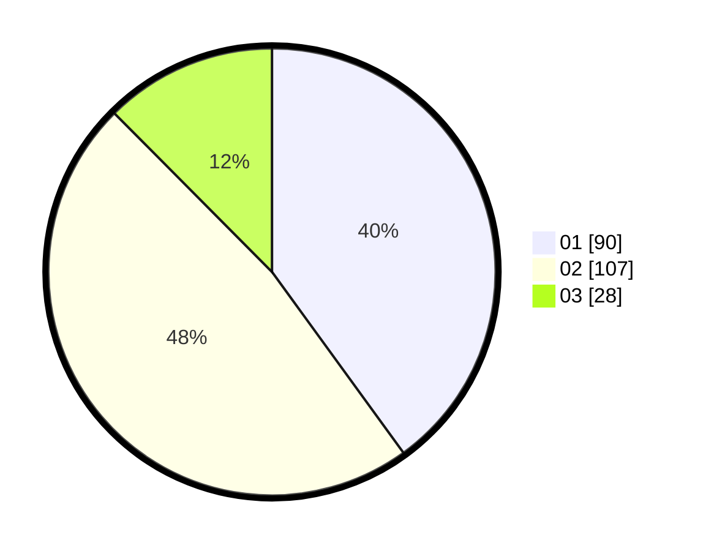

# Hasil

Hasil perolehan suara paslon dapat dilihat pada file paslon-01.txt, paslon-02.txt, dan paslon-03.txt.

Jika tidak ada, artinya data tersebut belum ada pada SIREKAP.

## Perolehan Suara

 * Paslon 01: **90**.
 * Paslon 02: **107**.
 * Paslon 03: **28**.

## Foto C Plano

https://sirekap-obj-formc.kpu.go.id/cfd6/pemilu/ppwp/31/74/05/10/01/3174051001089-20240214-185600--8293aeb9-424c-42b0-8efc-c0882d792546.jpg

https://sirekap-obj-formc.kpu.go.id/cfd6/pemilu/ppwp/31/74/05/10/01/3174051001089-20240214-185603--fb4521d3-8b60-4cf6-919e-48bdf4a2b9ca.jpg

https://sirekap-obj-formc.kpu.go.id/cfd6/pemilu/ppwp/31/74/05/10/01/3174051001089-20240214-185607--119bf78d-b518-4cc5-a18a-b9108f4f2d88.jpg

## DATA PEMILIH TETAP

Jumlah pemilih dalam DPT: **271**.
 * L: **126**.
 * P: **145**.

## DATA PENGGUNA HAK PILIH

Jumlah pengguna hak pilih dalam DPT: **224**.
 * L: **98**.
 * P: **126**.

Jumlah pengguna hak pilih dalam DPTb: **0**.
 * L: **0**.
 * P: **0**.

Jumlah pengguna hak pilih dalam DPK: **3**.
 * L: **2**.
 * P: **1**.

Jumlah pengguna hak pilih: **227**.
 * L: **100**.
 * P: **127**.

## JUMLAH SUARA SAH DAN TIDAK SAH

JUMLAH SELURUH SUARA SAH: **225**.

JUMLAH SUARA TIDAK SAH: **2**.

JUMLAH SELURUH SUARA SAH DAN SUARA TIDAK SAH: **227**.
