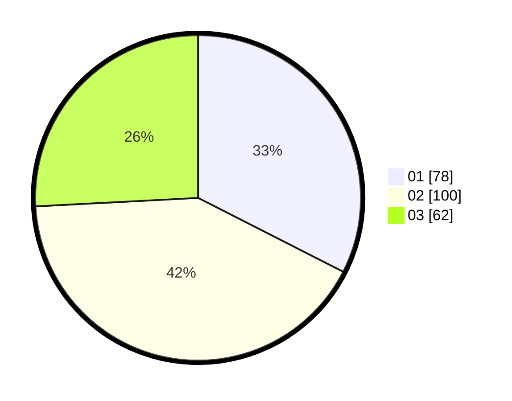

# Hasil

Hasil perolehan suara paslon dapat dilihat pada file paslon-01.txt, paslon-02.txt, dan paslon-03.txt.

Jika tidak ada, artinya data tersebut belum ada pada SIREKAP.

## Perolehan Suara

 * Paslon 01: **78**.
 * Paslon 02: **100**.
 * Paslon 03: **62**.

## Foto C Plano

https://sirekap-obj-formc.kpu.go.id/4185/pemilu/ppwp/31/74/05/10/01/3174051001110-20240215-014429--e10f4bde-9858-4c42-8e9a-58be973765ef.jpg

https://sirekap-obj-formc.kpu.go.id/4185/pemilu/ppwp/31/74/05/10/01/3174051001110-20240215-014512--3de51288-1238-4169-b8dd-f89a4fceced1.jpg

https://sirekap-obj-formc.kpu.go.id/4185/pemilu/ppwp/31/74/05/10/01/3174051001110-20240215-014604--91bcf5c2-b007-4795-8e39-580bd58b3580.jpg

## DATA PEMILIH TETAP

Jumlah pemilih dalam DPT: **299**.
 * L: **152**.
 * P: **147**.

## DATA PENGGUNA HAK PILIH

Jumlah pengguna hak pilih dalam DPT: **240**.
 * L: **118**.
 * P: **122**.

Jumlah pengguna hak pilih dalam DPTb: **2**.
 * L: **1**.
 * P: **1**.

Jumlah pengguna hak pilih dalam DPK: **0**.
 * L: **0**.
 * P: **0**.

Jumlah pengguna hak pilih: **242**.
 * L: **119**.
 * P: **123**.

## JUMLAH SUARA SAH DAN TIDAK SAH

JUMLAH SELURUH SUARA SAH: **240**.

JUMLAH SUARA TIDAK SAH: **2**.

JUMLAH SELURUH SUARA SAH DAN SUARA TIDAK SAH: **242**.
