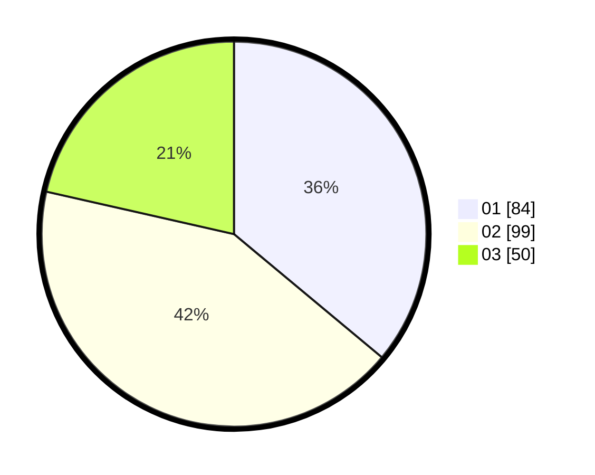

# Hasil

Hasil perolehan suara paslon dapat dilihat pada file paslon-01.txt, paslon-02.txt, dan paslon-03.txt.

Jika tidak ada, artinya data tersebut belum ada pada SIREKAP.

## Perolehan Suara

 * Paslon 01: **84**.
 * Paslon 02: **99**.
 * Paslon 03: **50**.

## Foto C Plano

https://sirekap-obj-formc.kpu.go.id/a152/pemilu/ppwp/31/74/05/10/01/3174051001117-20240214-200939--14eb37c9-4783-4646-ab30-e775cb746ab8.jpg

https://sirekap-obj-formc.kpu.go.id/a152/pemilu/ppwp/31/74/05/10/01/3174051001117-20240214-200955--83645525-bd43-42c6-9fcd-60784c2d9a96.jpg

https://sirekap-obj-formc.kpu.go.id/a152/pemilu/ppwp/31/74/05/10/01/3174051001117-20240214-201009--d4e4e998-26b9-4dc0-a387-acf551113ec9.jpg

## DATA PEMILIH TETAP

Jumlah pemilih dalam DPT: **286**.
 * L: **147**.
 * P: **139**.

## DATA PENGGUNA HAK PILIH

Jumlah pengguna hak pilih dalam DPT: **236**.
 * L: **125**.
 * P: **111**.

Jumlah pengguna hak pilih dalam DPTb: **0**.
 * L: **0**.
 * P: **0**.

Jumlah pengguna hak pilih dalam DPK: **2**.
 * L: **0**.
 * P: **2**.

Jumlah pengguna hak pilih: **238**.
 * L: **125**.
 * P: **113**.

## JUMLAH SUARA SAH DAN TIDAK SAH

JUMLAH SELURUH SUARA SAH: **233**.

JUMLAH SUARA TIDAK SAH: **5**.

JUMLAH SELURUH SUARA SAH DAN SUARA TIDAK SAH: **238**.
