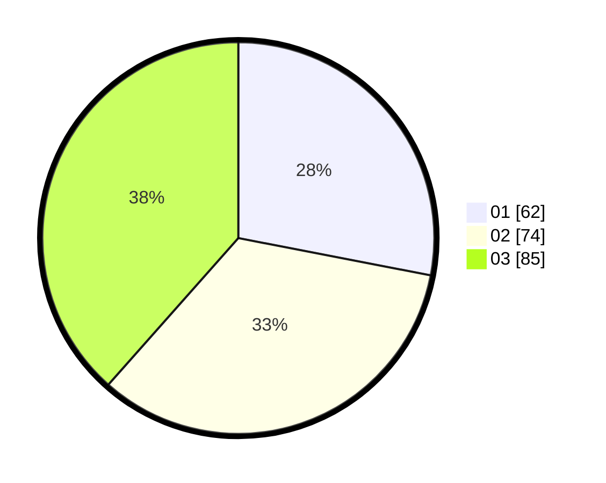

# Hasil

Hasil perolehan suara paslon dapat dilihat pada file paslon-01.txt, paslon-02.txt, dan paslon-03.txt.

Jika tidak ada, artinya data tersebut belum ada pada SIREKAP.

## Perolehan Suara

 * Paslon 01: **62**.
 * Paslon 02: **74**.
 * Paslon 03: **85**.

## Foto C Plano

https://sirekap-obj-formc.kpu.go.id/012c/pemilu/ppwp/31/74/05/10/01/3174051001118-20240217-115445--549a7965-ed18-493c-9451-a650885e11d5.jpg

https://sirekap-obj-formc.kpu.go.id/012c/pemilu/ppwp/31/74/05/10/01/3174051001118-20240217-115439--959fb17e-feda-41c6-8ab3-954b03c2cae1.jpg

https://sirekap-obj-formc.kpu.go.id/012c/pemilu/ppwp/31/74/05/10/01/3174051001118-20240217-115431--a2064678-7103-471e-b259-37f237f98ab3.jpg
