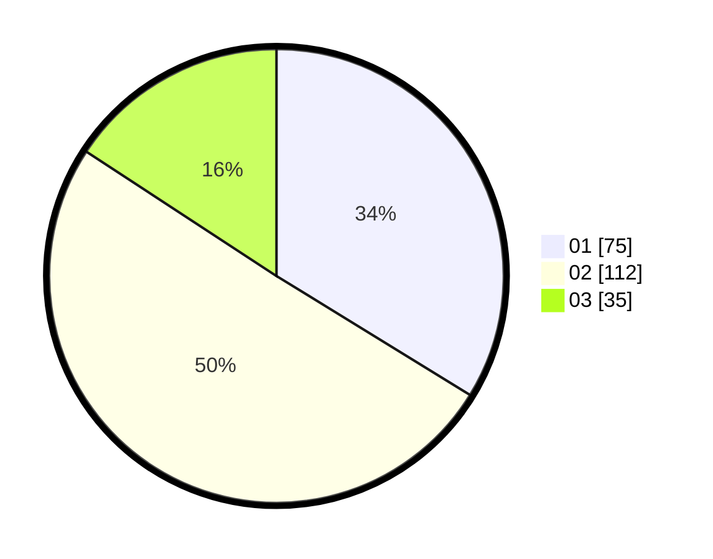

# Hasil

Hasil perolehan suara paslon dapat dilihat pada file paslon-01.txt, paslon-02.txt, dan paslon-03.txt.

Jika tidak ada, artinya data tersebut belum ada pada SIREKAP.

## Perolehan Suara

 * Paslon 01: **75**.
 * Paslon 02: **112**.
 * Paslon 03: **35**.

## Foto C Plano

https://sirekap-obj-formc.kpu.go.id/4925/pemilu/ppwp/31/74/05/10/01/3174051001120-20240214-202438--ed84cc25-5127-4972-a94d-cfec2925b299.jpg

https://sirekap-obj-formc.kpu.go.id/4925/pemilu/ppwp/31/74/05/10/01/3174051001120-20240214-202441--8e3c78a0-c48b-4b4d-bf74-ce920c5af8c3.jpg
