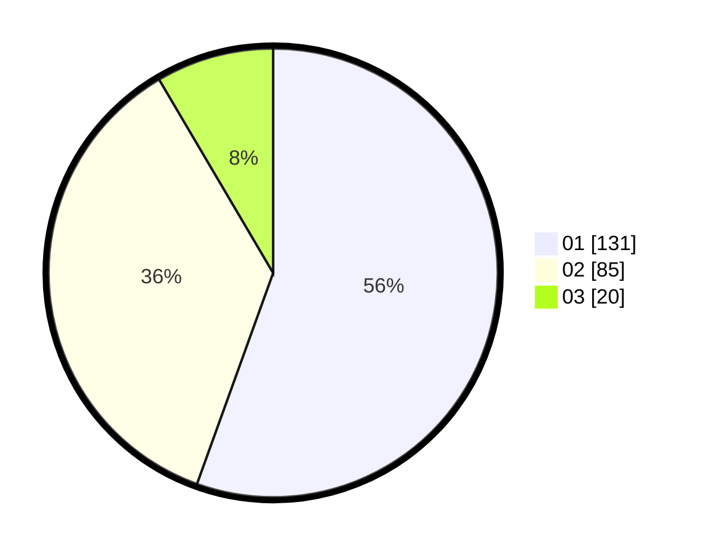

# Hasil

Hasil perolehan suara paslon dapat dilihat pada file paslon-01.txt, paslon-02.txt, dan paslon-03.txt.

Jika tidak ada, artinya data tersebut belum ada pada SIREKAP.

## Perolehan Suara

 * Paslon 01: **131**.
 * Paslon 02: **85**.
 * Paslon 03: **20**.

## Foto C Plano

https://sirekap-obj-formc.kpu.go.id/1a67/pemilu/ppwp/31/74/05/10/01/3174051001125-20240214-195302--fb4447e8-c3f7-4074-9415-72c9ec232d8d.jpg

https://sirekap-obj-formc.kpu.go.id/1a67/pemilu/ppwp/31/74/05/10/01/3174051001125-20240214-195428--f083b76e-3241-4342-9f1a-79cd9ae12174.jpg

https://sirekap-obj-formc.kpu.go.id/1a67/pemilu/ppwp/31/74/05/10/01/3174051001125-20240214-195432--db9276d4-c79e-41a8-8b71-01f04630676f.jpg

## DATA PEMILIH TETAP

Jumlah pemilih dalam DPT: **296**.
 * L: **138**.
 * P: **158**.

## DATA PENGGUNA HAK PILIH

Jumlah pengguna hak pilih dalam DPT: **238**.
 * L: **109**.
 * P: **129**.

Jumlah pengguna hak pilih dalam DPTb: **2**.
 * L: **1**.
 * P: **1**.

Jumlah pengguna hak pilih dalam DPK: **1**.
 * L: **1**.
 * P: **0**.

Jumlah pengguna hak pilih: **241**.
 * L: **111**.
 * P: **130**.

## JUMLAH SUARA SAH DAN TIDAK SAH

JUMLAH SELURUH SUARA SAH: **237**.

JUMLAH SUARA TIDAK SAH: **4**.

JUMLAH SELURUH SUARA SAH DAN SUARA TIDAK SAH: **241**.
