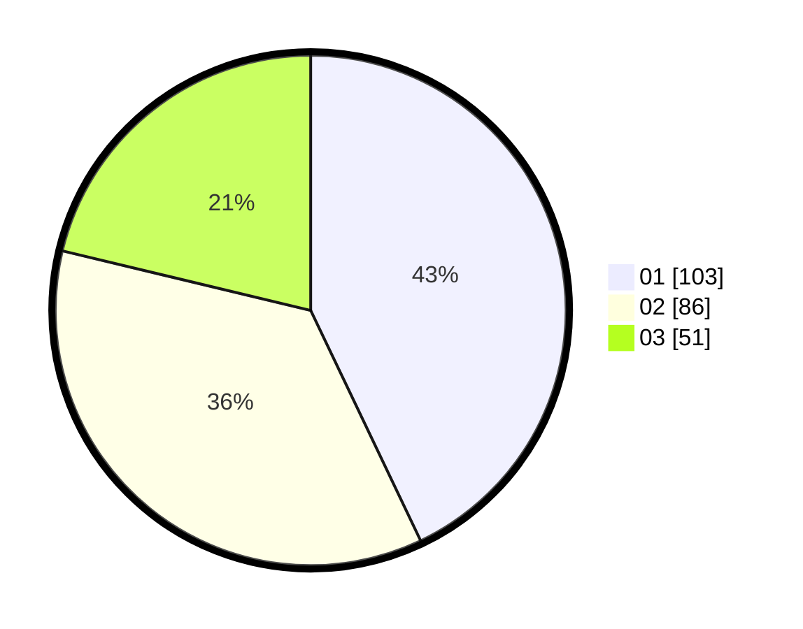

# Hasil

Hasil perolehan suara paslon dapat dilihat pada file paslon-01.txt, paslon-02.txt, dan paslon-03.txt.

Jika tidak ada, artinya data tersebut belum ada pada SIREKAP.

## Perolehan Suara

 * Paslon 01: **103**.
 * Paslon 02: **86**.
 * Paslon 03: **51**.

## Foto C Plano

https://sirekap-obj-formc.kpu.go.id/a2ec/pemilu/ppwp/31/74/05/10/01/3174051001134-20240214-155840--f74f61c3-e461-4320-9c69-a817dc7c82cc.jpg

https://sirekap-obj-formc.kpu.go.id/a2ec/pemilu/ppwp/31/74/05/10/01/3174051001134-20240214-155928--1cbe3b40-f1e3-4588-a704-36d2ff4aaecb.jpg

https://sirekap-obj-formc.kpu.go.id/a2ec/pemilu/ppwp/31/74/05/10/01/3174051001134-20240214-160132--ec3f21b2-4191-480b-accb-52dddcb9a0b2.jpg

## DATA PEMILIH TETAP

Jumlah pemilih dalam DPT: **292**.
 * L: **145**.
 * P: **147**.

## DATA PENGGUNA HAK PILIH

Jumlah pengguna hak pilih dalam DPT: **245**.
 * L: **119**.
 * P: **126**.

Jumlah pengguna hak pilih dalam DPTb: **0**.
 * L: **0**.
 * P: **0**.

Jumlah pengguna hak pilih dalam DPK: **0**.
 * L: **0**.
 * P: **0**.

Jumlah pengguna hak pilih: **245**.
 * L: **119**.
 * P: **126**.

## JUMLAH SUARA SAH DAN TIDAK SAH

JUMLAH SELURUH SUARA SAH: **240**.

JUMLAH SUARA TIDAK SAH: **5**.

JUMLAH SELURUH SUARA SAH DAN SUARA TIDAK SAH: **245**.
