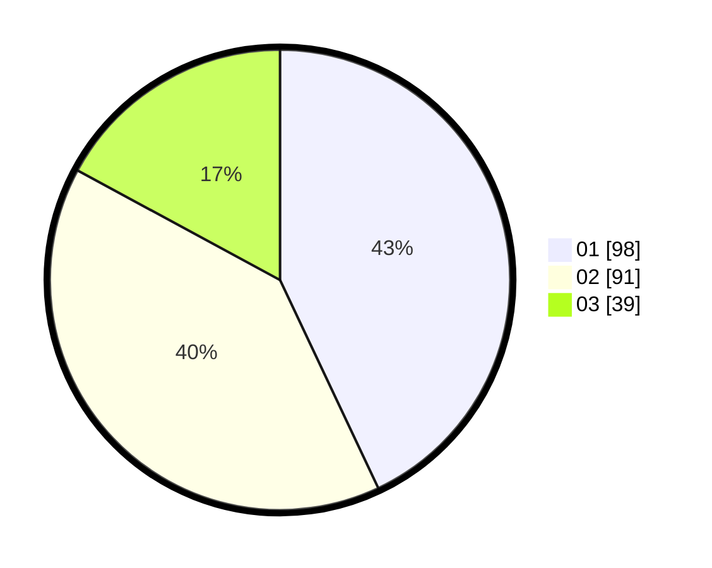

# Hasil

Hasil perolehan suara paslon dapat dilihat pada file paslon-01.txt, paslon-02.txt, dan paslon-03.txt.

Jika tidak ada, artinya data tersebut belum ada pada SIREKAP.

## Perolehan Suara

 * Paslon 01: **98**.
 * Paslon 02: **91**.
 * Paslon 03: **39**.

## Foto C Plano

https://sirekap-obj-formc.kpu.go.id/bdd3/pemilu/ppwp/31/74/05/10/01/3174051001135-20240214-224715--2efb00bf-2eda-4b35-be55-057f42a65c30.jpg

https://sirekap-obj-formc.kpu.go.id/bdd3/pemilu/ppwp/31/74/05/10/01/3174051001135-20240214-214855--08011f3d-3abf-4e7c-b7e7-cb09c216a604.jpg

https://sirekap-obj-formc.kpu.go.id/bdd3/pemilu/ppwp/31/74/05/10/01/3174051001135-20240214-210853--bbe6e376-56af-43bd-b65a-95e0b6301379.jpg
