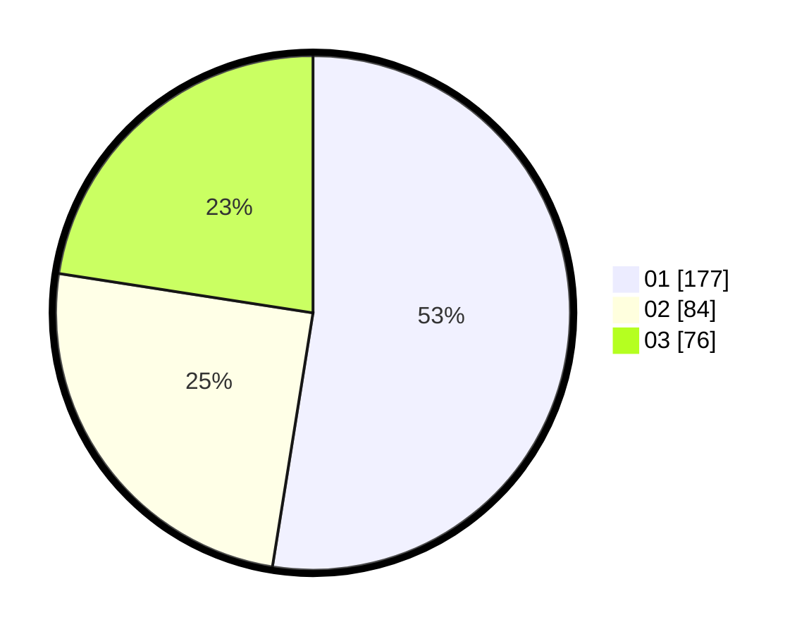

# Hasil

Hasil perolehan suara paslon dapat dilihat pada file paslon-01.txt, paslon-02.txt, dan paslon-03.txt.

Jika tidak ada, artinya data tersebut belum ada pada SIREKAP.

## Perolehan Suara

 * Paslon 01: **177**.
 * Paslon 02: **84**.
 * Paslon 03: **76**.

## Foto C Plano

https://sirekap-obj-formc.kpu.go.id/213b/pemilu/ppwp/31/74/05/10/02/3174051002002-20240217-143318--db764822-1410-46e1-bce2-5c9f1ad82bc7.jpg

https://sirekap-obj-formc.kpu.go.id/213b/pemilu/ppwp/31/74/05/10/02/3174051002002-20240217-143449--bb6f88e0-dbb4-49aa-975f-a90f3fa47f95.jpg

https://sirekap-obj-formc.kpu.go.id/213b/pemilu/ppwp/31/74/05/10/02/3174051002002-20240217-143621--f96d4af4-03db-4c06-9f77-5121cd3e0b27.jpg

## DATA PEMILIH TETAP

Jumlah pemilih dalam DPT: **0**.
 * L: **0**.
 * P: **0**.

## DATA PENGGUNA HAK PILIH

Jumlah pengguna hak pilih dalam DPT: **828**.
 * L: **503**.
 * P: **775**.

Jumlah pengguna hak pilih dalam DPTb: **888**.
 * L: **808**.
 * P: **850**.

Jumlah pengguna hak pilih dalam DPK: **253**.
 * L: **137**.
 * P: **229**.

Jumlah pengguna hak pilih: **0**.
 * L: **0**.
 * P: **0**.

## JUMLAH SUARA SAH DAN TIDAK SAH

JUMLAH SELURUH SUARA SAH: **257**.

JUMLAH SUARA TIDAK SAH: **1**.

JUMLAH SELURUH SUARA SAH DAN SUARA TIDAK SAH: **254**.
